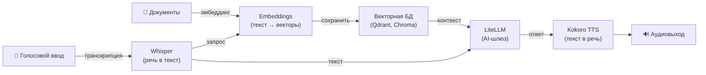

[English](README.md) | [简体中文](README-zh.md) | [繁體中文](README-zh-Hant.md) | [Русский](README-ru.md)

# Kokoro — синтез речи на Docker

[](https://github.com/hwdsl2/docker-kokoro/actions/workflows/main.yml) &nbsp;[](https://opensource.org/licenses/MIT)

Docker-образ для запуска сервера синтеза речи [Kokoro](https://github.com/hexgrad/kokoro). Предоставляет API синтеза речи, совместимый с OpenAI. Основан на Debian (python:3.12-slim). Разработан для простого, приватного, самостоятельно размещаемого развёртывания.

**Возможности:**

- Совместимый с OpenAI эндпоинт `POST /v1/audio/speech` — любое приложение, использующее OpenAI TTS API, переключается с изменением одной строки
- 20+ высококачественных голосов: американский и британский английский, мужские и женские
- Поддерживает как имена голосов OpenAI (`alloy`, `nova`, `echo`, ...), так и нативные идентификаторы Kokoro (`af_heart`, `bm_george`, ...)
- Аудио остаётся на вашем сервере — данные не передаются третьим лицам
- Все основные форматы вывода: `mp3`, `wav`, `flac`, `opus`, `aac`, `pcm`
- Поддержка стриминга — установите `stream=true`, чтобы получать аудио по мере синтеза каждого предложения, сокращая время до первого звука
- Офлайн/изолированный режим — работа без интернета с предварительно кешированной моделью (`KOKORO_LOCAL_ONLY`)
- Автоматическая сборка и публикация через [GitHub Actions](https://github.com/hwdsl2/docker-kokoro/actions/workflows/main.yml)
- Постоянный кеш модели через том Docker
- Мультиархитектурный: `linux/amd64`, `linux/arm64`

**Также доступно:**

- ИИ/Аудио: [Whisper (STT)](https://github.com/hwdsl2/docker-whisper/blob/main/README-ru.md), [Embeddings](https://github.com/hwdsl2/docker-embeddings/blob/main/README-ru.md), [LiteLLM](https://github.com/hwdsl2/docker-litellm/blob/main/README-ru.md)
- VPN: [WireGuard](https://github.com/hwdsl2/docker-wireguard/blob/main/README-ru.md), [OpenVPN](https://github.com/hwdsl2/docker-openvpn/blob/main/README-ru.md), [IPsec VPN](https://github.com/hwdsl2/docker-ipsec-vpn-server/blob/master/README-ru.md), [Headscale](https://github.com/hwdsl2/docker-headscale/blob/main/README-ru.md)

**Совет:** Whisper, Kokoro, Embeddings и LiteLLM можно [использовать совместно](#использование-с-другими-ai-сервисами) для построения полного приватного AI-стека на собственном сервере.

## Быстрый старт

Запустите сервер Kokoro TTS следующей командой:

```bash
docker run \
    --name kokoro \
    --restart=always \
    -v kokoro-data:/var/lib/kokoro \
    -p 8880:8880 \
    -d hwdsl2/kokoro-server
```

**Важно:** Этот образ требует не менее 1,5 ГБ свободной оперативной памяти из-за среды выполнения PyTorch и модели Kokoro. Системы с 1 ГБ ОЗУ и менее не поддерживаются.

**Примечание:** Для развёртываний, доступных из интернета, **настоятельно рекомендуется** использовать [обратный прокси](#использование-обратного-прокси) для добавления HTTPS. В этом случае также замените `-p 8880:8880` на `-p 127.0.0.1:8880:8880` в команде `docker run`, чтобы предотвратить прямой доступ к незашифрованному порту. Установите `KOKORO_API_KEY` в файле `env`, когда сервер доступен из публичного интернета.

Модель Kokoro (~320 МБ) загружается и кешируется при первом запуске. Проверьте журналы, чтобы убедиться, что сервер готов:

```bash
docker logs kokoro
```

После появления сообщения «Kokoro text-to-speech server is ready» синтезируйте первый аудиофайл:

```bash
curl http://IP_вашего_сервера:8880/v1/audio/speech \
    -H "Content-Type: application/json" \
    -d '{"model":"tts-1","input":"Привет, мир!","voice":"af_heart"}' \
    --output speech.mp3
```

## Требования

- Сервер Linux (локальный или облачный) с установленным Docker
- Поддерживаемые архитектуры: `amd64` (x86_64), `arm64` (например, Raspberry Pi 4/5, AWS Graviton)
- Минимальная свободная ОЗУ: ~1,5 ГБ (модель ~320 МБ; среде выполнения PyTorch требуется дополнительная память)
- Интернет-доступ для первоначальной загрузки модели (после этого модель кешируется локально). Не требуется при использовании `KOKORO_LOCAL_ONLY=true` с предварительно кешированной моделью.

Для развёртываний, доступных из интернета, см. [Использование обратного прокси](#использование-обратного-прокси).

## Скачать

Получите доверенную сборку из [Docker Hub](https://hub.docker.com/r/hwdsl2/kokoro-server/):

```bash
docker pull hwdsl2/kokoro-server
```

Либо скачайте из [Quay.io](https://quay.io/repository/hwdsl2/kokoro-server):

```bash
docker pull quay.io/hwdsl2/kokoro-server
docker image tag quay.io/hwdsl2/kokoro-server hwdsl2/kokoro-server
```

Поддерживаемые платформы: `linux/amd64` и `linux/arm64`.

## Переменные окружения

Все переменные необязательны. Если не заданы, автоматически применяются безопасные значения по умолчанию.

Этот Docker-образ использует следующие переменные, которые можно объявить в файле `env` (см. [пример](kokoro.env.example)):

| Переменная | Описание | По умолчанию |
|---|---|---|
| `KOKORO_VOICE` | Голос по умолчанию для синтеза. См. [доступные голоса](#доступные-голоса). Принимает идентификаторы голосов Kokoro (`af_heart`) или псевдонимы OpenAI (`alloy`). | `af_heart` |
| `KOKORO_SPEED` | Скорость речи по умолчанию. Диапазон: `0.25` (медленнее) до `4.0` (быстрее). | `1.0` |
| `KOKORO_PORT` | HTTP-порт для API (1–65535). | `8880` |
| `KOKORO_LANG_CODE` | Если задано, загружается только этот акцентный конвейер (`a`=американский, `b`=британский), что экономит память. Если не задано, загружаются оба конвейера, и правильный выбирается автоматически для каждого запроса по префиксу идентификатора голоса. | *(не задано)* |
| `KOKORO_API_KEY` | Необязательный Bearer-токен. Если задан, все запросы к API должны содержать `Authorization: Bearer <key>`. | *(не задано)* |
| `KOKORO_LOG_LEVEL` | Уровень логирования: `DEBUG`, `INFO`, `WARNING`, `ERROR`, `CRITICAL`. | `INFO` |
| `KOKORO_LOCAL_ONLY` | При установке любого непустого значения (например, `true`) отключает все загрузки моделей с HuggingFace. Для офлайн или изолированных развёртываний с предварительно кешированной моделью. | *(не задано)* |

**Примечание:** В файле `env` значения можно заключать в одинарные кавычки, например `VAR='value'`. Не добавляйте пробелы вокруг `=`. При изменении `KOKORO_PORT` обновите флаг `-p` в команде `docker run` соответствующим образом.

Пример использования файла `env`:

```bash
cp kokoro.env.example kokoro.env
# Отредактируйте kokoro.env, затем:
docker run \
    --name kokoro \
    --restart=always \
    -v kokoro-data:/var/lib/kokoro \
    -v ./kokoro.env:/kokoro.env:ro \
    -p 8880:8880 \
    -d hwdsl2/kokoro-server
```

Файл env монтируется в контейнер, изменения применяются при каждом перезапуске без пересоздания контейнера.

## Использование docker-compose

```bash
cp kokoro.env.example kokoro.env
# Отредактируйте kokoro.env при необходимости, затем:
docker compose up -d
docker logs kokoro
```

Пример `docker-compose.yml` (уже включён в проект):

```yaml
services:
  kokoro:
    image: hwdsl2/kokoro-server
    container_name: kokoro
    restart: always
    ports:
      - "8880:8880/tcp"  # Для хост-обратного прокси замените на "127.0.0.1:8880:8880/tcp"
    volumes:
      - kokoro-data:/var/lib/kokoro
      - ./kokoro.env:/kokoro.env:ro

volumes:
  kokoro-data:
```

**Примечание:** Для развёртываний, доступных из интернета, настоятельно рекомендуется добавить HTTPS с помощью [обратного прокси](#использование-обратного-прокси). В этом случае замените `"8880:8880/tcp"` на `"127.0.0.1:8880:8880/tcp"` в `docker-compose.yml`, чтобы предотвратить прямой доступ к незашифрованному порту. Установите `KOKORO_API_KEY` в файле `env`, когда сервер доступен из публичного интернета.

## Справочник API

API полностью совместим с [эндпоинтом синтеза речи OpenAI](https://platform.openai.com/docs/api-reference/audio/createSpeech). Любое приложение, уже вызывающее `https://api.openai.com/v1/audio/speech`, может переключиться на самостоятельно размещённый сервер, установив:

```
OPENAI_BASE_URL=http://IP_вашего_сервера:8880
```

### Синтез речи

```
POST /v1/audio/speech
Content-Type: application/json
```

**Тело запроса:**

| Поле | Тип | Обязательно | Описание |
|---|---|---|---|
| `model` | строка | ✅ | Передайте `tts-1`, `tts-1-hd` или `kokoro` (все используют Kokoro-82M). |
| `input` | строка | ✅ | Текст для синтеза. Максимум 4096 символов. |
| `voice` | строка | ✅ | Используемый голос. См. [доступные голоса](#доступные-голоса). Принимает идентификаторы Kokoro или псевдонимы OpenAI. |
| `response_format` | строка | — | Формат вывода. По умолчанию: `mp3`. Варианты: `mp3`, `opus`, `aac`, `flac`, `wav`, `pcm`. |
| `speed` | число | — | Скорость речи. По умолчанию: `1.0`. Диапазон: `0.25`–`4.0`. |
| `stream` | булево | — | Потоковая передача аудио по мере синтеза. По умолчанию: `false`. При значении `true` фрагменты аудио передаются через chunked transfer encoding по мере готовности каждого предложения, сокращая время до первого звука. `pcm` и `wav` — наиболее эффективные форматы для стриминга; `mp3` и `aac` также поддерживают потоковую передачу. |
| `volume_multiplier` | число | — | Множитель громкости вывода. По умолчанию: `1.0`. Диапазон: `0.1`–`2.0`. Значения выше `1.0` усиливают, ниже `1.0` ослабляют сигнал. Сэмплы обрезаются после масштабирования для предотвращения искажений. |

**Пример:**

```bash
curl http://IP_вашего_сервера:8880/v1/audio/speech \
    -H "Content-Type: application/json" \
    -d '{"model":"tts-1","input":"Быстрая коричневая лиса прыгает через ленивую собаку.","voice":"af_heart"}' \
    --output speech.mp3
```

**Ответ:** Бинарные аудиоданные с соответствующим заголовком `Content-Type`.

### Список голосов

```
GET /v1/voices
```

Возвращает все доступные идентификаторы голосов Kokoro и их сопоставление с псевдонимами OpenAI.

```bash
curl http://IP_вашего_сервера:8880/v1/voices
```

### Список моделей

```
GET /v1/models
```

Возвращает активные модели в совместимом с OpenAI формате.

```bash
curl http://IP_вашего_сервера:8880/v1/models
```

### Интерактивная документация API

Интерактивный Swagger UI доступен по адресу:

```
http://IP_вашего_сервера:8880/docs
```

## Доступные голоса

В любое время используйте `kokoro_manage --listvoices` для просмотра полного списка:

```bash
docker exec kokoro kokoro_manage --listvoices
```

| Идентификатор голоса | Акцент | Пол | Стиль |
|---|---|---|---|
| `af_heart` | Американский | Женский | Тёплый, естественный — **по умолчанию** |
| `af_bella` | Американский | Женский | Выразительный |
| `af_nova` | Американский | Женский | Чёткий |
| `af_sky` | Американский | Женский | Нейтральный, универсальный |
| `af_sarah` | Американский | Женский | Разговорный |
| `af_nicole` | Американский | Женский | Дружелюбный |
| `af_alloy` | Американский | Женский | Сбалансированный |
| `af_jessica` | Американский | Женский | Энергичный |
| `af_river` | Американский | Женский | Спокойный |
| `am_adam` | Американский | Мужской | Глубокий |
| `am_michael` | Американский | Мужской | Чёткий |
| `am_echo` | Американский | Мужской | Нейтральный |
| `am_eric` | Американский | Мужской | Авторитетный |
| `am_fenrir` | Американский | Мужской | Своеобразный |
| `am_liam` | Американский | Мужской | Разговорный |
| `am_onyx` | Американский | Мужской | Насыщенный |
| `am_puck` | Американский | Мужской | Выразительный |
| `am_santa` | Американский | Мужской | Тёплый |
| `bf_emma` | Британский | Женский | Чёткий, профессиональный |
| `bf_isabella` | Британский | Женский | Тёплый |
| `bf_alice` | Британский | Женский | Звонкий |
| `bf_lily` | Британский | Женский | Мягкий |
| `bm_george` | Британский | Мужской | Авторитетный |
| `bm_lewis` | Британский | Мужской | Плавный |
| `bm_daniel` | Британский | Мужской | Спокойный |
| `bm_fable` | Британский | Мужской | Выразительный |

> **Совет:** Британские голоса (`bf_*`, `bm_*`) автоматически обрабатываются британским конвейером — никакая дополнительная настройка не требуется. Сервер выбирает правильный акцентный конвейер по префиксу идентификатора голоса.

Все голоса используют один общий файл модели (~320 МБ). При переключении голосов повторная загрузка не требуется.

## Постоянные данные

Все данные сервера хранятся в Docker-томе (`/var/lib/kokoro` внутри контейнера):

```
/var/lib/kokoro/
├── hub/                           # Кэшированные файлы модели Kokoro (загружены с HuggingFace)
├── .port                          # Активный порт (используется kokoro_manage)
├── .voice                         # Активный голос по умолчанию (используется kokoro_manage)
└── .server_addr                   # Кэшированный IP сервера (используется kokoro_manage)
```

Создайте резервную копию Docker-тома для сохранения загруженной модели. Модель занимает ~320 МБ и загружается только один раз.

## Управление сервером

Используйте `kokoro_manage` внутри работающего контейнера для проверки и управления сервером.

**Показать информацию о сервере:**

```bash
docker exec kokoro kokoro_manage --showinfo
```

**Список доступных голосов:**

```bash
docker exec kokoro kokoro_manage --listvoices
```

## Смена голоса

Чтобы изменить голос по умолчанию, обновите `KOKORO_VOICE` в файле `kokoro.env` и перезапустите контейнер. Повторная загрузка модели не требуется — все голоса используют одну модель Kokoro-82M.

```bash
# Отредактируйте kokoro.env: задайте KOKORO_VOICE=bm_george
docker restart kokoro
```

> **Примечание:** В отдельных запросах к API всегда можно указать другой голос через поле `voice`, независимо от значения по умолчанию в контейнере.

## Использование обратного прокси

Для развёртываний, доступных из интернета, разместите обратный прокси перед TTS-сервером для обработки завершения HTTPS.

Используйте один из следующих адресов для доступа к контейнеру TTS из обратного прокси:

- **`kokoro:8880`** — если обратный прокси работает как контейнер в **той же сети Docker**, что и TTS-сервер.
- **`127.0.0.1:8880`** — если обратный прокси работает **на хосте** и порт `8880` опубликован.

При доступе сервера из публичного интернета установите `KOKORO_API_KEY` в файле `env`.

## Обновление Docker-образа

Для обновления Docker-образа и контейнера сначала [скачайте](#скачать) последнюю версию:

```bash
docker pull hwdsl2/kokoro-server
```

Если образ уже актуален, вы увидите:

```
Status: Image is up to date for hwdsl2/kokoro-server:latest
```

В противном случае будет скачана последняя версия. Удалите и пересоздайте контейнер:

```bash
docker rm -f kokoro
# Затем повторно выполните команду docker run из раздела «Быстрый старт» с теми же томом и портом.
```

Скачанные модели сохранятся в томе `kokoro-data`.

## Использование с другими AI-сервисами

Образы [Whisper (STT)](https://github.com/hwdsl2/docker-whisper/blob/main/README-ru.md), [Embeddings](https://github.com/hwdsl2/docker-embeddings/blob/main/README-ru.md), [LiteLLM](https://github.com/hwdsl2/docker-litellm/blob/main/README-ru.md) и [Kokoro (TTS)](https://github.com/hwdsl2/docker-kokoro/blob/main/README-ru.md) можно объединить для создания полного приватного AI-стека на собственном сервере — от голосового ввода/вывода до RAG-поиска с ответами. Whisper, Kokoro и Embeddings работают полностью локально. При использовании LiteLLM только с локальными моделями (например, Ollama) данные не передаются третьим сторонам. Если вы настроите LiteLLM с внешними провайдерами (например, OpenAI, Anthropic), ваши данные будут переданы этим провайдерам для обработки.



| Сервис | Назначение | Порт по умолчанию |
|---|---|---|
| **[Embeddings](https://github.com/hwdsl2/docker-embeddings/blob/main/README-ru.md)** | Преобразует текст в векторы для семантического поиска и RAG | `8000` |
| **[Whisper (STT)](https://github.com/hwdsl2/docker-whisper/blob/main/README-ru.md)** | Транскрибирует речь в текст | `9000` |
| **[LiteLLM](https://github.com/hwdsl2/docker-litellm/blob/main/README-ru.md)** | AI-шлюз — маршрутизирует запросы к OpenAI, Anthropic, Ollama и 100+ другим провайдерам | `4000` |
| **[Kokoro (TTS)](https://github.com/hwdsl2/docker-kokoro/blob/main/README-ru.md)** | Синтезирует естественно звучащую речь из текста | `8880` |

### Пример: голосовой конвейер

Транскрибируйте голосовой вопрос, получите ответ от LLM и синтезируйте его в речь:

```bash
# Шаг 1: Транскрибировать аудио в текст (Whisper)
TEXT=$(curl -s http://localhost:9000/v1/audio/transcriptions \
    -F file=@question.mp3 -F model=whisper-1 | jq -r .text)

# Шаг 2: Отправить текст в LLM и получить ответ (LiteLLM)
RESPONSE=$(curl -s http://localhost:4000/v1/chat/completions \
    -H "Authorization: Bearer <your-litellm-key>" \
    -H "Content-Type: application/json" \
    -d "{\"model\":\"gpt-4o\",\"messages\":[{\"role\":\"user\",\"content\":\"$TEXT\"}]}" \
    | jq -r '.choices[0].message.content')

# Шаг 3: Преобразовать ответ в речь (Kokoro TTS)
curl -s http://localhost:8880/v1/audio/speech \
    -H "Content-Type: application/json" \
    -d "{\"model\":\"tts-1\",\"input\":\"$RESPONSE\",\"voice\":\"af_heart\"}" \
    --output response.mp3
```

### Пример: конвейер RAG

Индексируйте документы для семантического поиска, затем извлекайте контекст и отвечайте на вопросы с помощью LLM:

```bash
# Шаг 1: Получить вектор фрагмента документа и сохранить его в векторной БД
curl -s http://localhost:8000/v1/embeddings \
    -H "Content-Type: application/json" \
    -d '{"input": "Docker simplifies deployment by packaging apps in containers.", "model": "text-embedding-ada-002"}' \
    | jq '.data[0].embedding'
# → Сохраните возвращённый вектор вместе с исходным текстом в Qdrant, Chroma, pgvector и т.д.

# Шаг 2: При запросе — получить вектор вопроса, найти подходящие фрагменты
#          в векторной БД, затем передать вопрос и контекст в LiteLLM.
curl -s http://localhost:4000/v1/chat/completions \
    -H "Authorization: Bearer <your-litellm-key>" \
    -H "Content-Type: application/json" \
    -d '{
      "model": "gpt-4o",
      "messages": [
        {"role": "system", "content": "Отвечай только на основе предоставленного контекста."},
        {"role": "user", "content": "Что делает Docker?\n\nКонтекст: Docker упрощает развёртывание, упаковывая приложения в контейнеры."}
      ]
    }' \
    | jq -r '.choices[0].message.content'
```

## Технические подробности

- Базовый образ: `python:3.12-slim` (Debian)
- Среда выполнения: Python 3 (виртуальное окружение в `/opt/venv`)
- TTS-движок: [Kokoro](https://github.com/hexgrad/kokoro) (Kokoro-82M, Apache 2.0) с CPU-бэкендом PyTorch
- API-фреймворк: [FastAPI](https://fastapi.tiangolo.com/) + [Uvicorn](https://www.uvicorn.org/)
- Аудиокодирование: [soundfile](https://github.com/bastibe/python-soundfile) (wav/flac), [ffmpeg](https://ffmpeg.org/) (mp3/aac/opus)
- Директория данных: `/var/lib/kokoro` (Docker-том)
- Хранение модели: формат HuggingFace Hub внутри тома — загружается один раз, переиспользуется при перезапусках
- Частота дискретизации: 24 кГц (нативный вывод Kokoro)

## Лицензия

**Примечание:** Программные компоненты внутри готового образа (такие как Kokoro и его зависимости) распространяются под лицензиями, выбранными соответствующими правообладателями. При использовании готового образа пользователь несёт ответственность за соблюдение всех соответствующих лицензий на программное обеспечение, содержащееся в образе.

Copyright (C) 2026 Lin Song   
Данная работа распространяется под [лицензией MIT](https://opensource.org/licenses/MIT).

**Kokoro TTS** является собственностью hexgrad и распространяется под [лицензией Apache 2.0](https://github.com/hexgrad/kokoro/blob/main/LICENSE).

Этот проект является независимой Docker-оболочкой для Kokoro и не связан с hexgrad или OpenAI, не одобрен и не спонсирован ими.