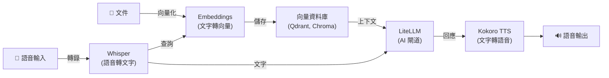

[English](README.md) | [简体中文](README-zh.md) | [繁體中文](README-zh-Hant.md) | [Русский](README-ru.md)

# Docker 上的 Kokoro 文字轉語音

[](https://github.com/hwdsl2/docker-kokoro/actions/workflows/main.yml) &nbsp;[](https://opensource.org/licenses/MIT) &nbsp;[](https://vpnsetup.net/kokoro-notebook)

一個用於執行 [Kokoro](https://github.com/hexgrad/kokoro) 文字轉語音伺服器的 Docker 映像。提供與 OpenAI 相容的音訊語音 API。基於 Debian（python:3.12-slim）。專為簡單、私密、自架伺服器而設計。

**功能特性：**

- 相容 OpenAI 的 `POST /v1/audio/speech` 端點 —— 已使用 OpenAI TTS API 的應用只需修改一行即可切換
- 20+ 種高品質語音：美式英語和英式英語，男女均有
- 同時支援 OpenAI 語音名稱（`alloy`、`nova`、`echo` 等）和原生 Kokoro 語音 ID（`af_heart`、`bm_george` 等）
- 音訊保留在您的伺服器上 —— 不向第三方傳送資料
- 支援所有主流輸出格式：`mp3`、`wav`、`flac`、`opus`、`aac`、`pcm`
- 串流傳輸支援 —— 設定 `stream=true` 可在每句話合成完成後立即接收音訊，減少首次出聲的等待時間
- NVIDIA GPU（CUDA）加速推理（`:cuda` 映像標籤）
- 離線/氣隙模式 —— 使用預快取模型無需存取網際網路（`KOKORO_LOCAL_ONLY`）
- 透過 [GitHub Actions](https://github.com/hwdsl2/docker-kokoro/actions/workflows/main.yml) 自動建置和發佈
- 透過 Docker 資料捲持久化模型快取
- 多架構：`linux/amd64`、`linux/arm64`

**另提供：**

- 線上試用：[在 Colab 中開啟](https://vpnsetup.net/kokoro-notebook)——無需 Docker 或安裝
- AI/音訊：[Whisper (STT)](https://github.com/hwdsl2/docker-whisper/blob/main/README-zh-Hant.md)、[Embeddings](https://github.com/hwdsl2/docker-embeddings/blob/main/README-zh-Hant.md)、[LiteLLM](https://github.com/hwdsl2/docker-litellm/blob/main/README-zh-Hant.md)
- VPN：[WireGuard](https://github.com/hwdsl2/docker-wireguard/blob/main/README-zh-Hant.md)、[OpenVPN](https://github.com/hwdsl2/docker-openvpn/blob/main/README-zh-Hant.md)、[IPsec VPN](https://github.com/hwdsl2/docker-ipsec-vpn-server/blob/master/README-zh-Hant.md)、[Headscale](https://github.com/hwdsl2/docker-headscale/blob/main/README-zh-Hant.md)

**提示：** Whisper、Kokoro、Embeddings 和 LiteLLM 可以[搭配使用](#與其他-ai-服務搭配使用)，在您自己的伺服器上建立完整的私密 AI 系統。

## 快速開始

使用以下指令啟動 Kokoro TTS 伺服器：

```bash
docker run \
    --name kokoro \
    --restart=always \
    -v kokoro-data:/var/lib/kokoro \
    -p 8880:8880 \
    -d hwdsl2/kokoro-server
```

<details>
<summary><strong>GPU 快速開始（NVIDIA CUDA）</strong></summary>

若您有 NVIDIA GPU，可使用 `:cuda` 映像進行硬體加速推理：

```bash
docker run \
    --name kokoro \
    --restart=always \
    --gpus=all \
    -v kokoro-data:/var/lib/kokoro \
    -p 8880:8880 \
    -d hwdsl2/kokoro-server:cuda
```

**需求：** NVIDIA GPU、已在主機上安裝 [NVIDIA 驅動程式](https://www.nvidia.com/en-us/drivers/) 535+ 以及 [NVIDIA Container Toolkit](https://docs.nvidia.com/datacenter/cloud-native/container-toolkit/latest/install-guide.html)。`:cuda` 映像僅支援 `linux/amd64`。

</details>

**重要：** 由於包含 PyTorch 執行階段與 Kokoro 模型，該映像需要至少 1.5 GB 可用記憶體。總記憶體為 1 GB 或更少的系統不受支援。

**注：** 如需面向網際網路的部署，**強烈建議**使用[反向代理](#使用反向代理)來新增 HTTPS。此時，還應將上述 `docker run` 指令中的 `-p 8880:8880` 替換為 `-p 127.0.0.1:8880:8880`，以防止從外部直接存取未加密連接埠。當伺服器可從公用網際網路存取時，請在 `env` 檔案中設定 `KOKORO_API_KEY`。

Kokoro 模型（約 320 MB）將在首次啟動時自動下載並快取。查看日誌確認伺服器已就緒：

```bash
docker logs kokoro
```

看到「Kokoro text-to-speech server is ready」後，即可合成您的第一個音訊檔案：

```bash
curl http://您的伺服器IP:8880/v1/audio/speech \
    -H "Content-Type: application/json" \
    -d '{"model":"tts-1","input":"你好，世界！","voice":"af_heart"}' \
    --output speech.mp3
```

## 系統需求

- 已安裝 Docker 的 Linux 伺服器（本機或雲端）
- 支援的架構：`amd64`（x86_64）、`arm64`（例如 Raspberry Pi 4/5、AWS Graviton）
- 最低可用記憶體：約 1.5 GB（模型約 320 MB；PyTorch 執行時需要額外記憶體）
- 首次下載模型需要網際網路存取（之後模型會快取在本機）。若使用預快取模型並設定 `KOKORO_LOCAL_ONLY=true` 則不需要。

**GPU 加速（`:cuda` 映像）需求：**

- 支援 CUDA 的 NVIDIA GPU（計算能力 6.0+）
- 主機上已安裝 [NVIDIA 驅動程式](https://www.nvidia.com/en-us/drivers/) 535 或更新版本
- 已安裝 [NVIDIA Container Toolkit](https://docs.nvidia.com/datacenter/cloud-native/container-toolkit/latest/install-guide.html)
- `:cuda` 映像僅支援 `linux/amd64`

對於面向網際網路的部署，請參閱[使用反向代理](#使用反向代理)以新增 HTTPS。

## 下載

從 [Docker Hub](https://hub.docker.com/r/hwdsl2/kokoro-server/) 取得受信任的建置：

```bash
docker pull hwdsl2/kokoro-server
```

如需 NVIDIA GPU 加速，請拉取 `:cuda` 標籤：

```bash
docker pull hwdsl2/kokoro-server:cuda
```

也可從 [Quay.io](https://quay.io/repository/hwdsl2/kokoro-server) 下載：

```bash
docker pull quay.io/hwdsl2/kokoro-server
docker image tag quay.io/hwdsl2/kokoro-server hwdsl2/kokoro-server
```

支援平台：`linux/amd64` 和 `linux/arm64`。`:cuda` 標籤僅支援 `linux/amd64`。

## 環境變數

所有變數均為選填。若未設定，將自動使用安全的預設值。

此 Docker 映像使用以下變數，可在 `env` 檔案中宣告（參見[範例](kokoro.env.example)）：

| 變數 | 說明 | 預設值 |
|---|---|---|
| `KOKORO_VOICE` | 合成語音的預設音色。參見[可用語音](#可用語音)了解所有選項。支援 Kokoro 語音 ID（`af_heart`）或 OpenAI 別名（`alloy`）。 | `af_heart` |
| `KOKORO_SPEED` | 預設語速。範圍：`0.25`（最慢）到 `4.0`（最快）。 | `1.0` |
| `KOKORO_PORT` | API 的 HTTP 埠（1–65535）。 | `8880` |
| `KOKORO_LANG_CODE` | 若已設定，則僅載入該語音處理管線（`a`=美式，`b`=英式），可節省記憶體。未設定時，兩個語音處理管線均會載入，並根據語音 ID 前綴自動為每個請求選擇正確的語音處理管線。 | *(未設定)* |
| `KOKORO_API_KEY` | 選填的 Bearer 權杖。設定後，所有 API 請求須包含 `Authorization: Bearer <key>`。 | *(未設定)* |
| `KOKORO_LOG_LEVEL` | 日誌等級：`DEBUG`、`INFO`、`WARNING`、`ERROR`、`CRITICAL`。 | `INFO` |
| `KOKORO_LOCAL_ONLY` | 設定為任意非空值（例如 `true`）時，停用所有 HuggingFace 模型下載。適用於離線或氣隙部署（需預快取模型）。 | *(未設定)* |

**注：** 在 `env` 檔案中，值可以用單引號括起來，例如 `VAR='value'`。`=` 兩側不要有空格。如果變更了 `KOKORO_PORT`，請相應更新 `docker run` 指令中的 `-p` 參數。

使用 `env` 檔案的範例：

```bash
cp kokoro.env.example kokoro.env
# 編輯 kokoro.env 後執行：
docker run \
    --name kokoro \
    --restart=always \
    -v kokoro-data:/var/lib/kokoro \
    -v ./kokoro.env:/kokoro.env:ro \
    -p 8880:8880 \
    -d hwdsl2/kokoro-server
```

`env` 檔案以綁定掛載方式傳入容器，每次重新啟動時自動生效，無需重新建立容器。

<details>
<summary>也可透過 <code>--env-file</code> 傳入</summary>

```bash
docker run \
    --name kokoro \
    --restart=always \
    -v kokoro-data:/var/lib/kokoro \
    -p 8880:8880 \
    --env-file=kokoro.env \
    -d hwdsl2/kokoro-server
```

</details>

## 使用 docker-compose

```bash
cp kokoro.env.example kokoro.env
# 依需求編輯 kokoro.env，然後：
docker compose up -d
docker logs kokoro
```

範例 `docker-compose.yml`（已包含在專案中）：

```yaml
services:
  kokoro:
    image: hwdsl2/kokoro-server
    container_name: kokoro
    restart: always
    ports:
      - "8880:8880/tcp"  # 如使用主機反向代理，改為 "127.0.0.1:8880:8880/tcp"
    volumes:
      - kokoro-data:/var/lib/kokoro
      - ./kokoro.env:/kokoro.env:ro

volumes:
  kokoro-data:
```

**注：** 如需面向公網部署，強烈建議使用[反向代理](#使用反向代理)啟用 HTTPS。此時請將 `docker-compose.yml` 中的 `"8880:8880/tcp"` 改為 `"127.0.0.1:8880:8880/tcp"`，以防止未加密連接埠被直接存取。當伺服器可從公用網際網路存取時，請在 `env` 檔案中設定 `KOKORO_API_KEY`。

<details>
<summary><strong>使用 docker-compose 啟用 GPU（NVIDIA CUDA）</strong></summary>

GPU 部署提供單獨的 `docker-compose.cuda.yml` 檔案：

```bash
cp kokoro.env.example kokoro.env
# 依需求編輯 kokoro.env，然後：
docker compose -f docker-compose.cuda.yml up -d
docker logs kokoro
```

範例 `docker-compose.cuda.yml`（已包含在專案中）：

```yaml
services:
  kokoro:
    image: hwdsl2/kokoro-server:cuda
    container_name: kokoro
    restart: always
    ports:
      - "8880:8880/tcp"  # 如使用主機反向代理，改為 "127.0.0.1:8880:8880/tcp"
    volumes:
      - kokoro-data:/var/lib/kokoro
      - ./kokoro.env:/kokoro.env:ro
    deploy:
      resources:
        reservations:
          devices:
            - driver: nvidia
              count: 1
              capabilities: [gpu]

volumes:
  kokoro-data:
```

</details>

## API 參考

該 API 與 [OpenAI 文字轉語音端點](https://developers.openai.com/api/reference/resources/audio/subresources/speech/methods/create)完全相容。任何已呼叫 `https://api.openai.com/v1/audio/speech` 的應用，只需設定以下環境變數即可切換到自架伺服器：

```
OPENAI_BASE_URL=http://您的伺服器IP:8880
```

### 合成語音

```
POST /v1/audio/speech
Content-Type: application/json
```

**請求主體：**

| 欄位 | 類型 | 是否必填 | 說明 |
|---|---|---|---|
| `model` | 字串 | ✅ | 傳入 `tts-1`、`tts-1-hd` 或 `kokoro`（均使用 Kokoro-82M）。 |
| `input` | 字串 | ✅ | 要合成的文字。最多 4096 個字元。 |
| `voice` | 字串 | ✅ | 使用的語音。參見[可用語音](#可用語音)。支援 Kokoro ID 或 OpenAI 別名。 |
| `response_format` | 字串 | — | 輸出格式。預設：`mp3`。選項：`mp3`、`opus`、`aac`、`flac`、`wav`、`pcm`。 |
| `speed` | 浮點數 | — | 語速。預設：`1.0`。範圍：`0.25`–`4.0`。 |
| `stream` | 布林值 | — | 合成時串流傳輸音訊。預設：`false`。為 `true` 時，每合成完一句話即透過分塊傳輸編碼傳送音訊區塊，減少首次出聲的等待時間。`pcm` 和 `wav` 是最高效的串流格式；`mp3` 和 `aac` 也支援串流傳輸。 |
| `volume_multiplier` | 浮點數 | — | 輸出音量倍數。預設：`1.0`。範圍：`0.1`–`2.0`。大於 `1.0` 時增大音量，小於 `1.0` 時減小音量。縮放後樣本將被截斷以防止失真。 |

**範例：**

```bash
curl http://您的伺服器IP:8880/v1/audio/speech \
    -H "Content-Type: application/json" \
    -d '{"model":"tts-1","input":"敏捷的棕色狐狸跳過了懶惰的狗。","voice":"af_heart"}' \
    --output speech.mp3
```

使用不同語音和格式：

```bash
curl http://您的伺服器IP:8880/v1/audio/speech \
    -H "Content-Type: application/json" \
    -d '{"model":"tts-1","input":"Hello from London.","voice":"bm_george","response_format":"wav","speed":0.9}' \
    --output speech.wav
```

使用 API 金鑰驗證：

```bash
curl http://您的伺服器IP:8880/v1/audio/speech \
    -H "Authorization: Bearer your_api_key" \
    -H "Content-Type: application/json" \
    -d '{"model":"tts-1","input":"Hello world","voice":"nova"}' \
    --output speech.mp3
```

**回應：** 帶有相應 `Content-Type` 標頭的二進位音訊資料。

### 列出語音

```
GET /v1/voices
```

返回所有可用的 Kokoro 語音 ID 及其 OpenAI 別名映射。

```bash
curl http://您的伺服器IP:8880/v1/voices
```

### 列出模型

```
GET /v1/models
```

以 OpenAI 相容格式返回目前啟用的模型。

```bash
curl http://您的伺服器IP:8880/v1/models
```

### 互動式 API 文件

訪問以下網址可使用互動式 Swagger UI：

```
http://您的伺服器IP:8880/docs
```

## 可用語音

隨時使用 `kokoro_manage --listvoices` 查看完整清單：

```bash
docker exec kokoro kokoro_manage --listvoices
```

| 語音 ID | 口音 | 性別 | 風格 |
|---|---|---|---|
| `af_heart` | 美式 | 女聲 | 溫暖、自然 —— **預設** |
| `af_bella` | 美式 | 女聲 | 富有表現力 |
| `af_nova` | 美式 | 女聲 | 清晰 |
| `af_sky` | 美式 | 女聲 | 中性、多用途 |
| `af_sarah` | 美式 | 女聲 | 對話感強 |
| `af_nicole` | 美式 | 女聲 | 親切 |
| `af_alloy` | 美式 | 女聲 | 均衡 |
| `af_jessica` | 美式 | 女聲 | 活力 |
| `af_river` | 美式 | 女聲 | 沉靜 |
| `am_adam` | 美式 | 男聲 | 低沉 |
| `am_michael` | 美式 | 男聲 | 清晰 |
| `am_echo` | 美式 | 男聲 | 中性 |
| `am_eric` | 美式 | 男聲 | 權威 |
| `am_fenrir` | 美式 | 男聲 | 獨特 |
| `am_liam` | 美式 | 男聲 | 對話感強 |
| `am_onyx` | 美式 | 男聲 | 醇厚 |
| `am_puck` | 美式 | 男聲 | 富有表現力 |
| `am_santa` | 美式 | 男聲 | 溫暖 |
| `bf_emma` | 英式 | 女聲 | 清晰、專業 |
| `bf_isabella` | 英式 | 女聲 | 溫暖 |
| `bf_alice` | 英式 | 女聲 | 清脆 |
| `bf_lily` | 英式 | 女聲 | 柔和 |
| `bm_george` | 英式 | 男聲 | 權威 |
| `bm_lewis` | 英式 | 男聲 | 流暢 |
| `bm_daniel` | 英式 | 男聲 | 沉靜 |
| `bm_fable` | 英式 | 男聲 | 富有表現力 |

> **提示：** 英式語音（`bf_*`、`bm_*`）由英式英語語音處理管線自動處理，無需任何設定 —— 伺服器會根據語音 ID 前綴自動選擇正確的語音處理管線。

所有語音共用同一個模型檔案（約 320 MB）。切換語音時無需重新下載。

## 持久化資料

所有伺服器資料存儲在 Docker 資料捲（容器內的 `/var/lib/kokoro`）中：

```
/var/lib/kokoro/
├── hub/                           # 快取的 Kokoro 模型檔案（從 HuggingFace 下載）
├── .port                          # 目前連接埠（供 kokoro_manage 使用）
├── .voice                         # 目前預設語音（供 kokoro_manage 使用）
└── .server_addr                   # 快取的伺服器 IP（供 kokoro_manage 使用）
```

備份 Docker 資料捲以保留已下載的模型。模型約 320 MB，僅需下載一次。

## 管理伺服器

在執行中的容器內使用 `kokoro_manage` 來檢查和管理伺服器。

**顯示伺服器資訊：**

```bash
docker exec kokoro kokoro_manage --showinfo
```

**列出可用語音：**

```bash
docker exec kokoro kokoro_manage --listvoices
```

## 變更語音

要變更預設語音，請在 `kokoro.env` 檔案中更新 `KOKORO_VOICE` 並重新啟動容器。無需重新下載模型 —— 所有語音共用同一個 Kokoro-82M 模型。

```bash
# 編輯 kokoro.env：設定 KOKORO_VOICE=bm_george
docker restart kokoro
```

> **注：** 單次 API 請求始終可以透過 `voice` 欄位指定不同的語音，不受容器預設設定影響。

## 使用反向代理

對於面向網際網路的部署，請在 TTS 伺服器前放置反向代理以處理 HTTPS 終止。

從反向代理存取 TTS 容器，使用以下地址之一：

- **`kokoro:8880`** —— 若反向代理作為容器執行在與 TTS 伺服器**相同的 Docker 網路**中。
- **`127.0.0.1:8880`** —— 若反向代理執行在**主機上**且埠 `8880` 已發佈。

**使用 [Caddy](https://caddyserver.com/docs/)（[Docker 映像](https://hub.docker.com/_/caddy)）的範例**（透過 Let's Encrypt 自動申請 TLS，反向代理在同一 Docker 網路中）：

`Caddyfile`：
```
kokoro.example.com {
  reverse_proxy kokoro:8880
}
```

**使用 nginx 的範例**（反向代理執行在主機上）：

```nginx
server {
    listen 443 ssl;
    server_name kokoro.example.com;

    ssl_certificate     /path/to/cert.pem;
    ssl_certificate_key /path/to/key.pem;

    location / {
        proxy_pass         http://127.0.0.1:8880;
        proxy_set_header   Host $host;
        proxy_set_header   X-Real-IP $remote_addr;
        proxy_set_header   X-Forwarded-For $proxy_add_x_forwarded_for;
        proxy_set_header   X-Forwarded-Proto $scheme;
        proxy_read_timeout 120s;
    }
}
```

面向公開網際網路時，請在 `env` 檔案中設定 `KOKORO_API_KEY`。

## 更新 Docker 映像

如需更新 Docker 映像和容器，首先[下載](#下載)最新版本：

```bash
docker pull hwdsl2/kokoro-server
```

如果映像已是最新版本，您將看到：

```
Status: Image is up to date for hwdsl2/kokoro-server:latest
```

否則將下載最新版本。刪除並重新建立容器：

```bash
docker rm -f kokoro
# 然後使用相同的資料捲和連接埠重新執行快速開始中的 docker run 指令。
```

您下載的模型將保留在 `kokoro-data` 資料捲中。

## 與其他 AI 服務搭配使用

[Whisper (STT)](https://github.com/hwdsl2/docker-whisper/blob/main/README-zh-Hant.md)、[Embeddings](https://github.com/hwdsl2/docker-embeddings/blob/main/README-zh-Hant.md)、[LiteLLM](https://github.com/hwdsl2/docker-litellm/blob/main/README-zh-Hant.md) 和 [Kokoro (TTS)](https://github.com/hwdsl2/docker-kokoro/blob/main/README-zh-Hant.md) 映像可以組合使用，在您自己的伺服器上建立完整的私密 AI 系統——從語音輸入/輸出到檢索增強生成（RAG）。Whisper、Kokoro 和 Embeddings 完全在本地端執行。當 LiteLLM 僅使用本地端模型（例如 Ollama）時，資料不會傳送給第三方。如果您將 LiteLLM 設定為使用外部提供商（例如 OpenAI、Anthropic），您的資料將被傳送至這些提供商處理。



| 服務 | 功能 | 預設連接埠 |
|---|---|---|
| **[Embeddings](https://github.com/hwdsl2/docker-embeddings/blob/main/README-zh-Hant.md)** | 將文字轉換為向量，用於語意搜尋和 RAG | `8000` |
| **[Whisper (STT)](https://github.com/hwdsl2/docker-whisper/blob/main/README-zh-Hant.md)** | 將語音音訊轉錄為文字 | `9000` |
| **[LiteLLM](https://github.com/hwdsl2/docker-litellm/blob/main/README-zh-Hant.md)** | AI 閘道——將請求路由至 OpenAI、Anthropic、Ollama 及 100+ 其他提供商 | `4000` |
| **[Kokoro (TTS)](https://github.com/hwdsl2/docker-kokoro/blob/main/README-zh-Hant.md)** | 將文字轉換為自然語音 | `8880` |

<details>
<summary><strong>語音對話範例</strong></summary>

將語音問題轉錄為文字，從大型語言模型取得回答，並轉換為語音輸出：

```bash
# 第一步：將語音音訊轉錄為文字（Whisper）
TEXT=$(curl -s http://localhost:9000/v1/audio/transcriptions \
    -F file=@question.mp3 -F model=whisper-1 | jq -r .text)

# 第二步：將文字傳送給大型語言模型並取得回應（LiteLLM）
RESPONSE=$(curl -s http://localhost:4000/v1/chat/completions \
    -H "Authorization: Bearer <your-litellm-key>" \
    -H "Content-Type: application/json" \
    -d "{\"model\":\"gpt-4o\",\"messages\":[{\"role\":\"user\",\"content\":\"$TEXT\"}]}" \
    | jq -r '.choices[0].message.content')

# 第三步：將回應轉換為語音（Kokoro TTS）
curl -s http://localhost:8880/v1/audio/speech \
    -H "Content-Type: application/json" \
    -d "{\"model\":\"tts-1\",\"input\":\"$RESPONSE\",\"voice\":\"af_heart\"}" \
    --output response.mp3
```

</details>

<details>
<summary><strong>RAG 檢索增強生成範例</strong></summary>

對文件進行向量化以實現語意檢索，並將檢索到的上下文傳送給大型語言模型進行問答：

```bash
# 步驟 1：對文件片段進行向量化並存入向量資料庫
curl -s http://localhost:8000/v1/embeddings \
    -H "Content-Type: application/json" \
    -d '{"input": "Docker simplifies deployment by packaging apps in containers.", "model": "text-embedding-ada-002"}' \
    | jq '.data[0].embedding'
# → 將返回的向量連同原文一起存入 Qdrant、Chroma、pgvector 等向量資料庫。

# 步驟 2：查詢時，對問題進行向量化並從向量資料庫檢索最相關的文件片段，
#          然後將問題和檢索到的上下文傳送給 LiteLLM 以取得 LLM 回應。
curl -s http://localhost:4000/v1/chat/completions \
    -H "Authorization: Bearer <your-litellm-key>" \
    -H "Content-Type: application/json" \
    -d '{
      "model": "gpt-4o",
      "messages": [
        {"role": "system", "content": "請僅根據所提供的上下文進行回答。"},
        {"role": "user", "content": "Docker 的作用是什麼？\n\n上下文：Docker 通過將應用打包為容器來簡化部署流程。"}
      ]
    }' \
    | jq -r '.choices[0].message.content'
```

</details>

## 技術細節

- 基礎映像：`python:3.12-slim`（Debian）
- 執行時：Python 3（虛擬環境位於 `/opt/venv`）
- 映像大小：約 515 MB（`:latest`），約 4.5 GB（`:cuda`）
- TTS 引擎：[Kokoro](https://github.com/hexgrad/kokoro)（Kokoro-82M，Apache 2.0），使用 PyTorch（CPU 和 CUDA GPU）
- API 框架：[FastAPI](https://fastapi.tiangolo.com/) + [Uvicorn](https://www.uvicorn.org/)
- 音訊編碼：[soundfile](https://github.com/bastibe/python-soundfile)（wav/flac）、[ffmpeg](https://ffmpeg.org/)（mp3/aac/opus）
- 資料目錄：`/var/lib/kokoro`（Docker 資料捲）
- 模型儲存：資料捲內的 HuggingFace Hub 格式 —— 下載一次，重啟後複用
- 採樣率：24 kHz（Kokoro 原生輸出）

## 授權條款

**注：** 預構建映像中包含的軟體元件（如 Kokoro 及其相依套件）均受各自版權持有者所選授權條款約束。使用預構建映像時，使用者有責任確保其使用方式符合映像內所有軟體的相關授權條款要求。

著作權所有 (C) 2026 Lin Song   
本作品採用 [MIT 授權條款](https://opensource.org/licenses/MIT)。

**Kokoro TTS** 版權歸 hexgrad 所有，依據 [Apache License 2.0](https://github.com/hexgrad/kokoro/blob/main/LICENSE) 分發。

本專案是 Kokoro 的獨立 Docker 封裝，與 hexgrad 或 OpenAI 無關聯、無背書。