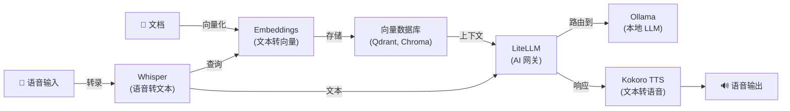

[English](README.md) | [简体中文](README-zh.md) | [繁體中文](README-zh-Hant.md) | [Русский](README-ru.md)

# Docker 上的 Kokoro 文字转语音

[](https://github.com/hwdsl2/docker-kokoro/actions/workflows/main.yml) &nbsp;[](https://opensource.org/licenses/MIT) &nbsp;[](https://vpnsetup.net/kokoro-notebook)

一个用于运行 [Kokoro](https://github.com/hexgrad/kokoro) 文字转语音服务器的 Docker 镜像。提供与 OpenAI 兼容的音频语音 API。基于 Debian（python:3.12-slim）。专为简单、私密、自托管而设计。

**功能特性：**

- 兼容 OpenAI 的 `POST /v1/audio/speech` 接口 —— 已使用 OpenAI TTS API 的应用只需修改一行即可切换
- 54 种高质量语音，覆盖 9 种语言（英语、日语、中文、西班牙语、法语、意大利语等）
- 同时支持 OpenAI 语音名称（`alloy`、`nova`、`echo` 等）和原生 Kokoro 语音 ID（`af_heart`、`bm_george` 等）
- 音频保留在您的服务器上 —— 不向第三方发送数据
- 支持所有主流输出格式：`mp3`、`wav`、`flac`、`opus`、`aac`、`pcm`
- 流式传输支持 —— 设置 `stream=true` 可在每句话合成完成后立即接收音频，减少首次出声的等待时间
- NVIDIA GPU（CUDA）加速推理（`:cuda` 镜像标签）
- 离线/气隙模式 —— 使用预缓存模型无需访问互联网（`KOKORO_LOCAL_ONLY`）
- 通过 [GitHub Actions](https://github.com/hwdsl2/docker-kokoro/actions/workflows/main.yml) 自动构建和发布
- 通过 Docker 数据卷持久化模型缓存
- 多架构：`linux/amd64`、`linux/arm64`

**另提供：**

- 在线试用：[在 Colab 中打开](https://vpnsetup.net/kokoro-notebook)——无需 Docker 或安装
- AI/音频：[Whisper (STT)](https://github.com/hwdsl2/docker-whisper/blob/main/README-zh.md)、[Embeddings](https://github.com/hwdsl2/docker-embeddings/blob/main/README-zh.md)、[LiteLLM](https://github.com/hwdsl2/docker-litellm/blob/main/README-zh.md)、[Ollama](https://github.com/hwdsl2/docker-ollama/blob/main/README-zh.md)
- VPN：[WireGuard](https://github.com/hwdsl2/docker-wireguard/blob/main/README-zh.md)、[OpenVPN](https://github.com/hwdsl2/docker-openvpn/blob/main/README-zh.md)、[IPsec VPN](https://github.com/hwdsl2/docker-ipsec-vpn-server/blob/master/README-zh.md)、[Headscale](https://github.com/hwdsl2/docker-headscale/blob/main/README-zh.md)

**提示：** Whisper、Kokoro、Embeddings、LiteLLM 和 Ollama 可以[配合使用](#与其他-ai-服务配合使用)，在您自己的服务器上搭建完整的私密 AI 系统。

## 快速开始

使用以下命令启动 Kokoro TTS 服务器：

```bash
docker run \
    --name kokoro \
    --restart=always \
    -v kokoro-data:/var/lib/kokoro \
    -p 8880:8880 \
    -d hwdsl2/kokoro-server
```

<details>
<summary><strong>GPU 快速开始（NVIDIA CUDA）</strong></summary>

如果您有 NVIDIA GPU，可使用 `:cuda` 镜像进行硬件加速推理：

```bash
docker run \
    --name kokoro \
    --restart=always \
    --gpus=all \
    -v kokoro-data:/var/lib/kokoro \
    -p 8880:8880 \
    -d hwdsl2/kokoro-server:cuda
```

**要求：** NVIDIA GPU、已在主机上安装 [NVIDIA 驱动](https://www.nvidia.com/en-us/drivers/) 535+ 以及 [NVIDIA Container Toolkit](https://docs.nvidia.com/datacenter/cloud-native/container-toolkit/latest/install-guide.html)。`:cuda` 镜像仅支持 `linux/amd64`。

</details>

**重要：** 由于包含 PyTorch 运行时和 Kokoro 模型，该镜像需要至少 1.5 GB 可用内存。总内存为 1 GB 或更少的系统不受支持。

**注：** 如需面向互联网的部署，**强烈建议**使用[反向代理](#使用反向代理)来添加 HTTPS。此时，还应将上述 `docker run` 命令中的 `-p 8880:8880` 替换为 `-p 127.0.0.1:8880:8880`，以防止从外部直接访问未加密端口。当服务器可从公网访问时，请在 `env` 文件中设置 `KOKORO_API_KEY`。

Kokoro 模型（约 320 MB）将在首次启动时自动下载并缓存。查看日志确认服务器已就绪：

```bash
docker logs kokoro
```

看到 "Kokoro text-to-speech server is ready" 后，即可合成您的第一个音频文件：

```bash
curl http://您的服务器IP:8880/v1/audio/speech \
    -H "Content-Type: application/json" \
    -d '{"model":"tts-1","input":"你好，世界！","voice":"af_heart"}' \
    --output speech.mp3
```

## 系统要求

- 安装了 Docker 的 Linux 服务器（本地或云端）
- 支持的架构：`amd64`（x86_64）、`arm64`（例如 Raspberry Pi 4/5、AWS Graviton）
- 最低可用内存：约 1.5 GB（模型约 320 MB；PyTorch 运行时需要额外内存）
- 首次下载模型需要互联网访问（之后模型会缓存在本地）。若使用预缓存模型并设置 `KOKORO_LOCAL_ONLY=true` 则不需要。

**GPU 加速（`:cuda` 镜像）要求：**

- 支持 CUDA 的 NVIDIA GPU（计算能力 6.0+）
- 主机上已安装 [NVIDIA 驱动](https://www.nvidia.com/en-us/drivers/) 535 或更高版本
- 已安装 [NVIDIA Container Toolkit](https://docs.nvidia.com/datacenter/cloud-native/container-toolkit/latest/install-guide.html)
- `:cuda` 镜像仅支持 `linux/amd64`

对于面向互联网的部署，请参阅[使用反向代理](#使用反向代理)以添加 HTTPS。

## 下载

从 [Docker Hub](https://hub.docker.com/r/hwdsl2/kokoro-server/) 获取可信构建：

```bash
docker pull hwdsl2/kokoro-server
```

如需 NVIDIA GPU 加速，请拉取 `:cuda` 标签：

```bash
docker pull hwdsl2/kokoro-server:cuda
```

也可从 [Quay.io](https://quay.io/repository/hwdsl2/kokoro-server) 下载：

```bash
docker pull quay.io/hwdsl2/kokoro-server
docker image tag quay.io/hwdsl2/kokoro-server hwdsl2/kokoro-server
```

支持平台：`linux/amd64` 和 `linux/arm64`。`:cuda` 标签仅支持 `linux/amd64`。

## 环境变量

所有变量均为可选。若未设置，将自动使用安全的默认值。

此 Docker 镜像使用以下变量，可在 `env` 文件中声明（参见[示例](kokoro.env.example)）：

| 变量 | 说明 | 默认值 |
|---|---|---|
| `KOKORO_VOICE` | 合成语音的默认音色。参见[可用语音](#可用语音)了解所有选项。支持 Kokoro 语音 ID（`af_heart`）或 OpenAI 别名（`alloy`）。 | `af_heart` |
| `KOKORO_SPEED` | 默认语速。范围：`0.25`（最慢）到 `4.0`（最快）。 | `1.0` |
| `KOKORO_PORT` | API 的 HTTP 端口（1–65535）。 | `8880` |
| `KOKORO_LANG_CODE` | 若已设置，则在启动时仅加载该语言的语音处理管线（`a`=美式英语，`b`=英式英语，`e`=西班牙语，`f`=法语，`h`=印地语，`i`=意大利语，`j`=日语，`p`=巴西葡萄牙语，`z`=普通话）。未设置时，根据 `KOKORO_VOICE` 前缀自动选择语音处理管线。当请求使用其他语言时，会按需创建对应的语音处理管线。 | *(未设置)* |
| `KOKORO_API_KEY` | 可选的 Bearer 令牌。设置后，所有 API 请求须包含 `Authorization: Bearer <key>`。 | *(未设置)* |
| `KOKORO_LOG_LEVEL` | 日志级别：`DEBUG`、`INFO`、`WARNING`、`ERROR`、`CRITICAL`。 | `INFO` |
| `KOKORO_LOCAL_ONLY` | 设置为任意非空值（例如 `true`）时，禁用所有 HuggingFace 模型下载。适用于离线或气隙部署（需预缓存模型）。 | *(未设置)* |

**注：** 在 `env` 文件中，值可以用单引号括起来，例如 `VAR='value'`。`=` 两侧不要有空格。如果更改了 `KOKORO_PORT`，请相应更新 `docker run` 命令中的 `-p` 参数。

使用 `env` 文件的示例：

```bash
cp kokoro.env.example kokoro.env
# 编辑 kokoro.env 后执行：
docker run \
    --name kokoro \
    --restart=always \
    -v kokoro-data:/var/lib/kokoro \
    -v ./kokoro.env:/kokoro.env:ro \
    -p 8880:8880 \
    -d hwdsl2/kokoro-server
```

`env` 文件以绑定挂载方式传入容器，每次重启时自动生效，无需重建容器。

<details>
<summary>也可通过 <code>--env-file</code> 传入</summary>

```bash
docker run \
    --name kokoro \
    --restart=always \
    -v kokoro-data:/var/lib/kokoro \
    -p 8880:8880 \
    --env-file=kokoro.env \
    -d hwdsl2/kokoro-server
```

</details>

## 使用 docker-compose

```bash
cp kokoro.env.example kokoro.env
# 按需编辑 kokoro.env，然后：
docker compose up -d
docker logs kokoro
```

示例 `docker-compose.yml`（已包含在项目中）：

```yaml
services:
  kokoro:
    image: hwdsl2/kokoro-server
    container_name: kokoro
    restart: always
    ports:
      - "8880:8880/tcp"  # 如使用主机反向代理，改为 "127.0.0.1:8880:8880/tcp"
    volumes:
      - kokoro-data:/var/lib/kokoro
      - ./kokoro.env:/kokoro.env:ro

volumes:
  kokoro-data:
```

**注：** 如需面向公网部署，强烈建议使用[反向代理](#使用反向代理)启用 HTTPS。此时请将 `docker-compose.yml` 中的 `"8880:8880/tcp"` 改为 `"127.0.0.1:8880:8880/tcp"`，以防止未加密端口被直接访问。当服务器可从公网访问时，请在 `env` 文件中设置 `KOKORO_API_KEY`。

<details>
<summary><strong>使用 docker-compose 启用 GPU（NVIDIA CUDA）</strong></summary>

GPU 部署提供单独的 `docker-compose.cuda.yml` 文件：

```bash
cp kokoro.env.example kokoro.env
# 按需编辑 kokoro.env，然后：
docker compose -f docker-compose.cuda.yml up -d
docker logs kokoro
```

示例 `docker-compose.cuda.yml`（已包含在项目中）：

```yaml
services:
  kokoro:
    image: hwdsl2/kokoro-server:cuda
    container_name: kokoro
    restart: always
    ports:
      - "8880:8880/tcp"  # 如使用主机反向代理，改为 "127.0.0.1:8880:8880/tcp"
    volumes:
      - kokoro-data:/var/lib/kokoro
      - ./kokoro.env:/kokoro.env:ro
    deploy:
      resources:
        reservations:
          devices:
            - driver: nvidia
              count: 1
              capabilities: [gpu]

volumes:
  kokoro-data:
```

</details>

## API 参考

该 API 与 [OpenAI 文字转语音接口](https://developers.openai.com/api/reference/resources/audio/subresources/speech/methods/create)完全兼容。任何已调用 `https://api.openai.com/v1/audio/speech` 的应用，只需设置以下环境变量即可切换到自托管：

```
OPENAI_BASE_URL=http://您的服务器IP:8880
```

### 合成语音

```
POST /v1/audio/speech
Content-Type: application/json
```

**请求体：**

| 字段 | 类型 | 是否必填 | 说明 |
|---|---|---|---|
| `model` | 字符串 | ✅ | 传入 `tts-1`、`tts-1-hd` 或 `kokoro`（均使用 Kokoro-82M）。 |
| `input` | 字符串 | ✅ | 要合成的文本。最多 4096 个字符。 |
| `voice` | 字符串 | ✅ | 使用的语音。参见[可用语音](#可用语音)。支持 Kokoro ID 或 OpenAI 别名。 |
| `response_format` | 字符串 | — | 输出格式。默认：`mp3`。选项：`mp3`、`opus`、`aac`、`flac`、`wav`、`pcm`。 |
| `speed` | 浮点数 | — | 语速。默认：`1.0`。范围：`0.25`–`4.0`。 |
| `stream` | 布尔值 | — | 合成时流式传输音频。默认：`false`。为 `true` 时，每合成完一句话即通过分块传输编码发送音频块，减少首次出声的等待时间。`pcm` 和 `wav` 是最高效的流式格式；`mp3` 和 `aac` 也支持流式传输。 |
| `volume_multiplier` | 浮点数 | — | 输出音量倍数。默认：`1.0`。范围：`0.1`–`2.0`。大于 `1.0` 时增大音量，小于 `1.0` 时减小音量。缩放后样本将被截断以防止失真。 |

**示例：**

```bash
curl http://您的服务器IP:8880/v1/audio/speech \
    -H "Content-Type: application/json" \
    -d '{"model":"tts-1","input":"敏捷的棕色狐狸跳过了懒惰的狗。","voice":"af_heart"}' \
    --output speech.mp3
```

使用不同语音和格式：

```bash
curl http://您的服务器IP:8880/v1/audio/speech \
    -H "Content-Type: application/json" \
    -d '{"model":"tts-1","input":"Hello from London.","voice":"bm_george","response_format":"wav","speed":0.9}' \
    --output speech.wav
```

使用 API 密钥认证：

```bash
curl http://您的服务器IP:8880/v1/audio/speech \
    -H "Authorization: Bearer your_api_key" \
    -H "Content-Type: application/json" \
    -d '{"model":"tts-1","input":"Hello world","voice":"nova"}' \
    --output speech.mp3
```

**响应：** 带有相应 `Content-Type` 标头的二进制音频数据。

### 列出语音

```
GET /v1/voices
```

返回所有可用的 Kokoro 语音 ID 及其 OpenAI 别名映射。

```bash
curl http://您的服务器IP:8880/v1/voices
```

### 列出模型

```
GET /v1/models
```

以 OpenAI 兼容格式返回当前活跃模型。

```bash
curl http://您的服务器IP:8880/v1/models
```

### 交互式 API 文档

访问以下地址可使用交互式 Swagger UI：

```
http://您的服务器IP:8880/docs
```

## 可用语音

随时使用 `kokoro_manage --listvoices` 查看完整列表：

```bash
docker exec kokoro kokoro_manage --listvoices
```

**美式英语：**

| 语音 ID | 性别 | 风格 |
|---|---|---|
| `af_heart` | 女声 | 温暖、自然 —— **默认** |
| `af_aoede` | 女声 | |
| `af_bella` | 女声 | 富有表现力 |
| `af_jessica` | 女声 | 活力 |
| `af_kore` | 女声 | |
| `af_nicole` | 女声 | 亲切 |
| `af_nova` | 女声 | 清晰 |
| `af_river` | 女声 | 沉静 |
| `af_sarah` | 女声 | 对话感强 |
| `af_sky` | 女声 | 中性、多用途 |
| `af_alloy` | 女声 | 均衡 |
| `am_adam` | 男声 | 低沉 |
| `am_michael` | 男声 | 清晰 |
| `am_echo` | 男声 | 中性 |
| `am_eric` | 男声 | 权威 |
| `am_fenrir` | 男声 | 独特 |
| `am_liam` | 男声 | 对话感强 |
| `am_onyx` | 男声 | 醇厚 |
| `am_puck` | 男声 | 富有表现力 |
| `am_santa` | 男声 | 温暖 |

**英式英语：**

| 语音 ID | 性别 | 风格 |
|---|---|---|
| `bf_emma` | 女声 | 清晰、专业 |
| `bf_isabella` | 女声 | 温暖 |
| `bf_alice` | 女声 | 清脆 |
| `bf_lily` | 女声 | 柔和 |
| `bm_george` | 男声 | 权威 |
| `bm_lewis` | 男声 | 流畅 |
| `bm_daniel` | 男声 | 沉静 |
| `bm_fable` | 男声 | 富有表现力 |

**日语：** `jf_alpha`、`jf_gongitsune`、`jf_nezumi`、`jf_tebukuro`、`jm_kumo`

**普通话：** `zf_xiaobei`、`zf_xiaoni`、`zf_xiaoxiao`、`zf_xiaoyi`、`zm_yunjian`、`zm_yunxi`、`zm_yunxia`、`zm_yunyang`

**西班牙语：** `ef_dora`、`em_alex`、`em_santa`

**法语：** `ff_siwis`

**印地语：** `hf_alpha`、`hf_beta`、`hm_omega`、`hm_psi`

**意大利语：** `if_sara`、`im_nicola`

**巴西葡萄牙语：** `pf_dora`、`pm_alex`、`pm_santa`

> **提示：** 服务器会根据语音 ID 前缀自动选择对应的语言处理管线，无需任何配置。例如，`jf_alpha` 会加载日语管线，`bf_emma` 会加载英式英语管线。其他语言的管线会在需要时按需创建。

所有语音共享同一个模型文件（约 320 MB）。切换语音时无需重新下载。

## 持久化数据

所有服务器数据存储在 Docker 数据卷（容器内的 `/var/lib/kokoro`）中：

```
/var/lib/kokoro/
├── hub/                           # 缓存的 Kokoro 模型文件（从 HuggingFace 下载）
├── .port                          # 当前端口（供 kokoro_manage 使用）
├── .voice                         # 当前默认语音（供 kokoro_manage 使用）
└── .server_addr                   # 缓存的服务器 IP（供 kokoro_manage 使用）
```

备份 Docker 数据卷以保留已下载的模型。模型约 320 MB，仅需下载一次。

## 管理服务器

在运行中的容器内使用 `kokoro_manage` 来检查和管理服务器。

**显示服务器信息：**

```bash
docker exec kokoro kokoro_manage --showinfo
```

**列出可用语音：**

```bash
docker exec kokoro kokoro_manage --listvoices
```

## 更换语音

要更换默认语音，请在 `kokoro.env` 文件中更新 `KOKORO_VOICE` 并重启容器。无需重新下载模型 —— 所有语音共用同一个 Kokoro-82M 模型。

```bash
# 编辑 kokoro.env：设置 KOKORO_VOICE=bm_george
docker restart kokoro
```

> **注：** 单次 API 请求始终可以通过 `voice` 字段指定不同的语音，不受容器默认设置影响。

## 使用反向代理

对于面向互联网的部署，请在 TTS 服务器前放置反向代理以处理 HTTPS 终止。

从反向代理访问 TTS 容器，使用以下地址之一：

- **`kokoro:8880`** —— 若反向代理作为容器运行在与 TTS 服务器**相同的 Docker 网络**中。
- **`127.0.0.1:8880`** —— 若反向代理运行在**主机上**且端口 `8880` 已发布。

**使用 [Caddy](https://caddyserver.com/docs/)（[Docker 镜像](https://hub.docker.com/_/caddy)）的示例**（通过 Let's Encrypt 自动申请 TLS，反向代理在同一 Docker 网络中）：

`Caddyfile`：
```
kokoro.example.com {
  reverse_proxy kokoro:8880
}
```

**使用 nginx 的示例**（反向代理运行在主机上）：

```nginx
server {
    listen 443 ssl;
    server_name kokoro.example.com;

    ssl_certificate     /path/to/cert.pem;
    ssl_certificate_key /path/to/key.pem;

    location / {
        proxy_pass         http://127.0.0.1:8880;
        proxy_set_header   Host $host;
        proxy_set_header   X-Real-IP $remote_addr;
        proxy_set_header   X-Forwarded-For $proxy_add_x_forwarded_for;
        proxy_set_header   X-Forwarded-Proto $scheme;
        proxy_read_timeout 120s;
    }
}
```

面向公网时，请在 `env` 文件中设置 `KOKORO_API_KEY`。

## 更新 Docker 镜像

如需更新 Docker 镜像和容器，首先[下载](#下载)最新版本：

```bash
docker pull hwdsl2/kokoro-server
```

如果镜像已是最新版本，您将看到：

```
Status: Image is up to date for hwdsl2/kokoro-server:latest
```

否则将下载最新版本。删除并重新创建容器：

```bash
docker rm -f kokoro
# 然后使用相同的数据卷和端口重新运行快速开始中的 docker run 命令。
```

您下载的模型将保留在 `kokoro-data` 数据卷中。

## 与其他 AI 服务配合使用

[Whisper (STT)](https://github.com/hwdsl2/docker-whisper/blob/main/README-zh.md)、[Embeddings](https://github.com/hwdsl2/docker-embeddings/blob/main/README-zh.md)、[LiteLLM](https://github.com/hwdsl2/docker-litellm/blob/main/README-zh.md)、[Kokoro (TTS)](https://github.com/hwdsl2/docker-kokoro/blob/main/README-zh.md) 和 [Ollama](https://github.com/hwdsl2/docker-ollama/blob/main/README-zh.md) 镜像可以组合使用，在您自己的服务器上搭建完整的私密 AI 系统——从语音输入/输出到检索增强生成（RAG）。Whisper、Kokoro 和 Embeddings 完全在本地运行。Ollama 在本地运行所有 LLM 推理，无需向第三方发送数据。如果您将 LiteLLM 配置为使用外部提供商（例如 OpenAI、Anthropic），您的数据将被发送至这些提供商处理。



| 服务 | 功能 | 默认端口 |
|---|---|---|
| **[Embeddings](https://github.com/hwdsl2/docker-embeddings/blob/main/README-zh.md)** | 将文本转换为向量，用于语义搜索和 RAG | `8000` |
| **[Whisper (STT)](https://github.com/hwdsl2/docker-whisper/blob/main/README-zh.md)** | 将语音音频转录为文本 | `9000` |
| **[LiteLLM](https://github.com/hwdsl2/docker-litellm/blob/main/README-zh.md)** | AI 网关——将请求路由至 OpenAI、Anthropic、Ollama 及 100+ 其他提供商 | `4000` |
| **[Kokoro (TTS)](https://github.com/hwdsl2/docker-kokoro/blob/main/README-zh.md)** | 将文本转换为自然语音 | `8880` |
| **[Ollama](https://github.com/hwdsl2/docker-ollama/blob/main/README-zh.md)** | 运行本地 LLM 模型（llama3、qwen、mistral 等） | `11434` |

<details>
<summary><strong>语音对话示例</strong></summary>

将语音问题转录为文本，从大型语言模型获取回答，并转换为语音输出：

```bash
# 第一步：将语音音频转录为文本（Whisper）
TEXT=$(curl -s http://localhost:9000/v1/audio/transcriptions \
    -F file=@question.mp3 -F model=whisper-1 | jq -r .text)

# 第二步：将文本发送给大型语言模型并获取响应（LiteLLM）
RESPONSE=$(curl -s http://localhost:4000/v1/chat/completions \
    -H "Authorization: Bearer <your-litellm-key>" \
    -H "Content-Type: application/json" \
    -d "{\"model\":\"gpt-4o\",\"messages\":[{\"role\":\"user\",\"content\":\"$TEXT\"}]}" \
    | jq -r '.choices[0].message.content')

# 第三步：将响应转换为语音（Kokoro TTS）
curl -s http://localhost:8880/v1/audio/speech \
    -H "Content-Type: application/json" \
    -d "{\"model\":\"tts-1\",\"input\":\"$RESPONSE\",\"voice\":\"af_heart\"}" \
    --output response.mp3
```

</details>

<details>
<summary><strong>RAG 检索增强生成示例</strong></summary>

对文档进行向量化以实现语义检索，并将检索到的上下文发送给大型语言模型进行问答：

```bash
# 第一步：对文档片段进行向量化并存入向量数据库
curl -s http://localhost:8000/v1/embeddings \
    -H "Content-Type: application/json" \
    -d '{"input": "Docker simplifies deployment by packaging apps in containers.", "model": "text-embedding-ada-002"}' \
    | jq '.data[0].embedding'
# → 将返回的向量连同原文一起存入 Qdrant、Chroma、pgvector 等向量数据库。

# 第二步：查询时，对问题进行向量化并从向量数据库检索最相关的文档片段，
#          然后将问题和检索到的上下文发送给 LiteLLM 以获取 LLM 回答。
curl -s http://localhost:4000/v1/chat/completions \
    -H "Authorization: Bearer <your-litellm-key>" \
    -H "Content-Type: application/json" \
    -d '{
      "model": "gpt-4o",
      "messages": [
        {"role": "system", "content": "请仅根据所提供的上下文进行回答。"},
        {"role": "user", "content": "Docker 的作用是什么？\n\n上下文：Docker 通过将应用打包为容器来简化部署流程。"}
      ]
    }' \
    | jq -r '.choices[0].message.content'
```

</details>


<details>
<summary><strong>完整技术栈 docker-compose 示例</strong></summary>

使用一条命令部署所有服务。LiteLLM 通过共享 Docker 网络内部连接到 Ollama — 在 `litellm.env` 中设置 `LITELLM_OLLAMA_BASE_URL=http://ollama:11434`。

**资源要求：** 同时运行所有服务至少需要 8 GB 内存（使用小型模型）。对于较大的 LLM 模型（8B+），建议 32 GB 或更多。您可以注释掉不需要的服务以减少内存使用。

```yaml
services:
  ollama:
    image: hwdsl2/ollama-server
    container_name: ollama
    restart: always
    # ports:
    #   - "11434:11434/tcp"  # 取消注释以直接访问 Ollama
    volumes:
      - ollama-data:/var/lib/ollama
      - ./ollama.env:/ollama.env:ro

  litellm:
    image: hwdsl2/litellm-server
    container_name: litellm
    restart: always
    ports:
      - "4000:4000/tcp"
    volumes:
      - litellm-data:/etc/litellm
      - ./litellm.env:/litellm.env:ro

  embeddings:
    image: hwdsl2/embeddings-server
    container_name: embeddings
    restart: always
    ports:
      - "8000:8000/tcp"
    volumes:
      - embeddings-data:/var/lib/embeddings
      - ./embed.env:/embed.env:ro

  whisper:
    image: hwdsl2/whisper-server
    container_name: whisper
    restart: always
    ports:
      - "9000:9000/tcp"
    volumes:
      - whisper-data:/var/lib/whisper
      - ./whisper.env:/whisper.env:ro

  kokoro:
    image: hwdsl2/kokoro-server
    container_name: kokoro
    restart: always
    ports:
      - "8880:8880/tcp"
    volumes:
      - kokoro-data:/var/lib/kokoro
      - ./kokoro.env:/kokoro.env:ro

volumes:
  ollama-data:
  litellm-data:
  embeddings-data:
  whisper-data:
  kokoro-data:
```

如需 NVIDIA GPU 加速，将 ollama、whisper 和 kokoro 的镜像标签改为 `:cuda`，并为这些服务添加以下配置：

```yaml
    deploy:
      resources:
        reservations:
          devices:
            - driver: nvidia
              count: 1
              capabilities: [gpu]
```

</details>

## 技术细节

- 基础镜像：`python:3.12-slim`（Debian）
- 运行时：Python 3（虚拟环境位于 `/opt/venv`）
- TTS 引擎：[Kokoro](https://github.com/hexgrad/kokoro)（Kokoro-82M，Apache 2.0），使用 PyTorch（CPU 和 CUDA GPU）
- API 框架：[FastAPI](https://fastapi.tiangolo.com/) + [Uvicorn](https://www.uvicorn.org/)
- 音频编码：[soundfile](https://github.com/bastibe/python-soundfile)（wav/flac）、[ffmpeg](https://ffmpeg.org/)（mp3/aac/opus）
- 数据目录：`/var/lib/kokoro`（Docker 数据卷）
- 模型存储：数据卷内的 HuggingFace Hub 格式 —— 下载一次，重启后复用
- 采样率：24 kHz（Kokoro 原生输出）

## 授权协议

**注：** 预构建镜像中包含的软件组件（如 Kokoro 及其依赖项）均受各自版权持有者所选许可证约束。使用预构建镜像时，用户有责任确保其使用方式符合镜像内所有软件的相关许可证要求。

版权所有 (C) 2026 Lin Song
本作品采用 [MIT 许可证](https://opensource.org/licenses/MIT)授权。

**Kokoro TTS** 版权归 hexgrad 所有，依据 [Apache License 2.0](https://github.com/hexgrad/kokoro/blob/main/LICENSE) 分发。

本项目是 Kokoro 的独立 Docker 封装，与 hexgrad 或 OpenAI 无关联、无背书。