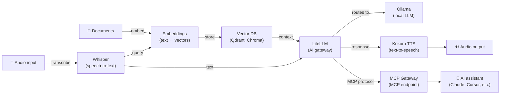

[English](README.md) | [简体中文](README-zh.md) | [繁體中文](README-zh-Hant.md) | [Русский](README-ru.md)

# Kokoro Text-to-Speech on Docker

[](https://github.com/hwdsl2/docker-kokoro/actions/workflows/main.yml) &nbsp;[](https://opensource.org/licenses/MIT) &nbsp;[](https://vpnsetup.net/kokoro-notebook)

Docker image to run a [Kokoro](https://github.com/hexgrad/kokoro) text-to-speech server. Provides an OpenAI-compatible audio speech API. Based on Debian (python:3.12-slim). Designed to be simple, private, and self-hosted.

**Features:**

- OpenAI-compatible `POST /v1/audio/speech` endpoint — any app using the OpenAI TTS API switches with a one-line change
- 54 high-quality voices across 9 languages (English, Japanese, Chinese, Spanish, French, Italian, and more)
- Accepts both OpenAI voice names (`alloy`, `nova`, `echo`, ...) and native Kokoro voice IDs (`af_heart`, `bm_george`, ...)
- Audio stays on your server — no data sent to third parties
- All major output formats supported: `mp3`, `wav`, `flac`, `opus`, `aac`, `pcm`
- Streaming support — set `stream=true` to receive audio as each sentence is synthesized, reducing time-to-first-audio
- NVIDIA GPU (CUDA) acceleration for faster inference (`:cuda` image tag)
- Offline/air-gapped mode — run without internet access using pre-cached model (`KOKORO_LOCAL_ONLY`)
- Automatically built and published via [GitHub Actions](https://github.com/hwdsl2/docker-kokoro/actions/workflows/main.yml)
- Persistent model cache via a Docker volume
- Multi-arch: `linux/amd64`, `linux/arm64`

**Also available:**

- Try it online: [Open in Colab](https://vpnsetup.net/kokoro-notebook) — no Docker or installation required
- AI/Audio: [Whisper (STT)](https://github.com/hwdsl2/docker-whisper), [Embeddings](https://github.com/hwdsl2/docker-embeddings), [LiteLLM](https://github.com/hwdsl2/docker-litellm), [Ollama (LLM)](https://github.com/hwdsl2/docker-ollama)
- VPN: [WireGuard](https://github.com/hwdsl2/docker-wireguard), [OpenVPN](https://github.com/hwdsl2/docker-openvpn), [IPsec VPN](https://github.com/hwdsl2/docker-ipsec-vpn-server), [Headscale](https://github.com/hwdsl2/docker-headscale)
- Tools: [MCP Gateway](https://github.com/hwdsl2/docker-mcp-gateway)

**Tip:** Whisper, Kokoro, Embeddings, LiteLLM, Ollama, and MCP Gateway can be [used together](#using-with-other-ai-services) to build a complete, private AI stack on your own server.

## Quick start

Use this command to set up a Kokoro TTS server:

```bash
docker run \
    --name kokoro \
    --restart=always \
    -v kokoro-data:/var/lib/kokoro \
    -p 8880:8880 \
    -d hwdsl2/kokoro-server
```

<details>
<summary><strong>GPU quick start (NVIDIA CUDA)</strong></summary>

If you have an NVIDIA GPU, use the `:cuda` image for hardware-accelerated inference:

```bash
docker run \
    --name kokoro \
    --restart=always \
    --gpus=all \
    -v kokoro-data:/var/lib/kokoro \
    -p 8880:8880 \
    -d hwdsl2/kokoro-server:cuda
```

**Requirements:** NVIDIA GPU, [NVIDIA driver](https://www.nvidia.com/en-us/drivers/) 535+, and the [NVIDIA Container Toolkit](https://docs.nvidia.com/datacenter/cloud-native/container-toolkit/latest/install-guide.html) installed on the host. The `:cuda` image is `linux/amd64` only.

</details>

**Important:** This image requires at least 1.5 GB of available RAM due to the PyTorch runtime and Kokoro model. Systems with 1 GB or less of total RAM are not supported.

**Note:** For internet-facing deployments, using a [reverse proxy](#using-a-reverse-proxy) to add HTTPS is **strongly recommended**. In that case, also replace `-p 8880:8880` with `-p 127.0.0.1:8880:8880` in the `docker run` command above, to prevent direct access to the unencrypted port. Set `KOKORO_API_KEY` in your `env` file when the server is accessible from the public internet.

The Kokoro model (~320 MB) is downloaded and cached on first start. Check the logs to confirm the server is ready:

```bash
docker logs kokoro
```

Once you see "Kokoro text-to-speech server is ready", synthesize your first audio file:

```bash
curl http://your_server_ip:8880/v1/audio/speech \
    -H "Content-Type: application/json" \
    -d '{"model":"tts-1","input":"Hello, world!","voice":"af_heart"}' \
    --output speech.mp3
```

## Requirements

- A Linux server (local or cloud) with Docker installed
- Supported architectures: `amd64` (x86_64), `arm64` (e.g. Raspberry Pi 4/5, AWS Graviton)
- Minimum RAM: ~1.5 GB free (model is ~320 MB; PyTorch runtime uses additional memory)
- Internet access for the initial model download (the model is cached locally afterwards). Not required if using `KOKORO_LOCAL_ONLY=true` with a pre-cached model.

**For GPU acceleration (`:cuda` image):**

- NVIDIA GPU with CUDA support (Compute Capability 6.0+)
- [NVIDIA driver](https://www.nvidia.com/en-us/drivers/) 535 or later installed on the host
- [NVIDIA Container Toolkit](https://docs.nvidia.com/datacenter/cloud-native/container-toolkit/latest/install-guide.html) installed
- The `:cuda` image supports `linux/amd64` only

For internet-facing deployments, see [Using a reverse proxy](#using-a-reverse-proxy) to add HTTPS.

## Download

Get the trusted build from the [Docker Hub registry](https://hub.docker.com/r/hwdsl2/kokoro-server/):

```bash
docker pull hwdsl2/kokoro-server
```

For NVIDIA GPU acceleration, pull the `:cuda` tag instead:

```bash
docker pull hwdsl2/kokoro-server:cuda
```

Alternatively, you may download from [Quay.io](https://quay.io/repository/hwdsl2/kokoro-server):

```bash
docker pull quay.io/hwdsl2/kokoro-server
docker image tag quay.io/hwdsl2/kokoro-server hwdsl2/kokoro-server
```

Supported platforms: `linux/amd64` and `linux/arm64`. The `:cuda` tag supports `linux/amd64` only.

## Environment variables

All variables are optional. If not set, secure defaults are used automatically.

This Docker image uses the following variables, that can be declared in an `env` file (see [example](kokoro.env.example)):

| Variable | Description | Default |
|---|---|---|
| `KOKORO_VOICE` | Default voice for synthesis. See [voices](#available-voices) for all options. Accepts Kokoro voice IDs (`af_heart`) or OpenAI aliases (`alloy`). | `af_heart` |
| `KOKORO_SPEED` | Default speech speed. Range: `0.25` (slowest) to `4.0` (fastest). | `1.0` |
| `KOKORO_PORT` | HTTP port for the API (1–65535). | `8880` |
| `KOKORO_LANG_CODE` | If set, loads only that language pipeline at startup (`a`=American English, `b`=British English, `e`=Spanish, `f`=French, `h`=Hindi, `i`=Italian, `j`=Japanese, `p`=Brazilian Portuguese, `z`=Mandarin Chinese). When unset, the pipeline is auto-selected from the `KOKORO_VOICE` prefix. Additional pipelines are created on demand when a request uses a different language. | *(not set)* |
| `KOKORO_API_KEY` | Optional Bearer token. If set, all API requests must include `Authorization: Bearer <key>`. | *(not set)* |
| `KOKORO_LOG_LEVEL` | Log level: `DEBUG`, `INFO`, `WARNING`, `ERROR`, `CRITICAL`. | `INFO` |
| `KOKORO_LOCAL_ONLY` | When set to any non-empty value (e.g. `true`), disables all HuggingFace model downloads. For offline or air-gapped deployments with pre-cached model. | *(not set)* |

**Note:** In your `env` file, you may enclose values in single quotes, e.g. `VAR='value'`. Do not add spaces around `=`. If you change `KOKORO_PORT`, update the `-p` flag in the `docker run` command accordingly.

Example using an `env` file:

```bash
cp kokoro.env.example kokoro.env
# Edit kokoro.env with your settings, then:
docker run \
    --name kokoro \
    --restart=always \
    -v kokoro-data:/var/lib/kokoro \
    -v ./kokoro.env:/kokoro.env:ro \
    -p 8880:8880 \
    -d hwdsl2/kokoro-server
```

The env file is bind-mounted into the container, so changes are picked up on every restart without recreating the container.

<details>
<summary>Alternatively, pass it with <code>--env-file</code></summary>

```bash
docker run \
    --name kokoro \
    --restart=always \
    -v kokoro-data:/var/lib/kokoro \
    -p 8880:8880 \
    --env-file=kokoro.env \
    -d hwdsl2/kokoro-server
```

</details>

## Using docker-compose

```bash
cp kokoro.env.example kokoro.env
# Edit kokoro.env as needed, then:
docker compose up -d
docker logs kokoro
```

Example `docker-compose.yml` (already included):

```yaml
services:
  kokoro:
    image: hwdsl2/kokoro-server
    container_name: kokoro
    restart: always
    ports:
      - "8880:8880/tcp"  # For a host-based reverse proxy, change to "127.0.0.1:8880:8880/tcp"
    volumes:
      - kokoro-data:/var/lib/kokoro
      - ./kokoro.env:/kokoro.env:ro

volumes:
  kokoro-data:
```

**Note:** For internet-facing deployments, using a [reverse proxy](#using-a-reverse-proxy) to add HTTPS is **strongly recommended**. In that case, also change `"8880:8880/tcp"` to `"127.0.0.1:8880:8880/tcp"` in `docker-compose.yml`, to prevent direct access to the unencrypted port. Set `KOKORO_API_KEY` in your `env` file when the server is accessible from the public internet.

<details>
<summary><strong>Using docker-compose with GPU (NVIDIA CUDA)</strong></summary>

A separate `docker-compose.cuda.yml` is provided for GPU deployments:

```bash
cp kokoro.env.example kokoro.env
# Edit kokoro.env as needed, then:
docker compose -f docker-compose.cuda.yml up -d
docker logs kokoro
```

Example `docker-compose.cuda.yml` (already included):

```yaml
services:
  kokoro:
    image: hwdsl2/kokoro-server:cuda
    container_name: kokoro
    restart: always
    ports:
      - "8880:8880/tcp"  # For a host-based reverse proxy, change to "127.0.0.1:8880:8880/tcp"
    volumes:
      - kokoro-data:/var/lib/kokoro
      - ./kokoro.env:/kokoro.env:ro
    deploy:
      resources:
        reservations:
          devices:
            - driver: nvidia
              count: 1
              capabilities: [gpu]

volumes:
  kokoro-data:
```

</details>

## API reference

The API is fully compatible with [OpenAI's text-to-speech endpoint](https://developers.openai.com/api/reference/resources/audio/subresources/speech/methods/create). Any application already calling `https://api.openai.com/v1/audio/speech` can switch to self-hosted by setting:

```
OPENAI_BASE_URL=http://your_server_ip:8880
```

### Synthesize speech

```
POST /v1/audio/speech
Content-Type: application/json
```

**Request body:**

| Field | Type | Required | Description |
|---|---|---|---|
| `model` | string | ✅ | Pass `tts-1`, `tts-1-hd`, or `kokoro` (all use Kokoro-82M). |
| `input` | string | ✅ | The text to synthesize. Maximum 4096 characters. |
| `voice` | string | ✅ | Voice to use. See [available voices](#available-voices). Accepts Kokoro IDs or OpenAI aliases. |
| `response_format` | string | — | Output format. Default: `mp3`. Options: `mp3`, `opus`, `aac`, `flac`, `wav`, `pcm`. |
| `speed` | float | — | Speech speed. Default: `1.0`. Range: `0.25`–`4.0`. |
| `stream` | boolean | — | Stream audio as it is synthesized. Default: `false`. When `true`, audio chunks are delivered via chunked transfer encoding as each sentence is ready, reducing time-to-first-audio. `pcm` and `wav` are the most efficient streaming formats; `mp3` and `aac` also stream cleanly. |
| `volume_multiplier` | float | — | Output volume multiplier. Default: `1.0`. Range: `0.1`–`2.0`. Values above `1.0` amplify, below `1.0` attenuate. Samples are clipped after scaling to prevent distortion. |

**Example:**

```bash
curl http://your_server_ip:8880/v1/audio/speech \
    -H "Content-Type: application/json" \
    -d '{"model":"tts-1","input":"The quick brown fox jumps over the lazy dog.","voice":"af_heart"}' \
    --output speech.mp3
```

With a different voice and format:

```bash
curl http://your_server_ip:8880/v1/audio/speech \
    -H "Content-Type: application/json" \
    -d '{"model":"tts-1","input":"Hello from London.","voice":"bm_george","response_format":"wav","speed":0.9}' \
    --output speech.wav
```

With API key authentication:

```bash
curl http://your_server_ip:8880/v1/audio/speech \
    -H "Authorization: Bearer your_api_key" \
    -H "Content-Type: application/json" \
    -d '{"model":"tts-1","input":"Hello world","voice":"nova"}' \
    --output speech.mp3
```

**Response:** Binary audio data with the appropriate `Content-Type` header.

### List voices

```
GET /v1/voices
```

Returns all available Kokoro voice IDs and their OpenAI alias mappings.

```bash
curl http://your_server_ip:8880/v1/voices
```

### List models

```
GET /v1/models
```

Returns the active models in OpenAI-compatible format.

```bash
curl http://your_server_ip:8880/v1/models
```

### Interactive API docs

An interactive Swagger UI is available at:

```
http://your_server_ip:8880/docs
```

## Available voices

Use `kokoro_manage --listvoices` to see the full list at any time:

```bash
docker exec kokoro kokoro_manage --listvoices
```

**American English:**

| Voice ID | Gender | Style |
|---|---|---|
| `af_heart` | Female | Warm, natural — **default** |
| `af_aoede` | Female | |
| `af_bella` | Female | Expressive |
| `af_jessica` | Female | Energetic |
| `af_kore` | Female | |
| `af_nicole` | Female | Friendly |
| `af_nova` | Female | Clear |
| `af_river` | Female | Calm |
| `af_sarah` | Female | Conversational |
| `af_sky` | Female | Neutral, versatile |
| `af_alloy` | Female | Balanced |
| `am_adam` | Male | Deep |
| `am_michael` | Male | Clear |
| `am_echo` | Male | Neutral |
| `am_eric` | Male | Authoritative |
| `am_fenrir` | Male | Distinctive |
| `am_liam` | Male | Conversational |
| `am_onyx` | Male | Rich |
| `am_puck` | Male | Expressive |
| `am_santa` | Male | Warm |

**British English:**

| Voice ID | Gender | Style |
|---|---|---|
| `bf_emma` | Female | Clear, professional |
| `bf_isabella` | Female | Warm |
| `bf_alice` | Female | Crisp |
| `bf_lily` | Female | Soft |
| `bm_george` | Male | Authoritative |
| `bm_lewis` | Male | Smooth |
| `bm_daniel` | Male | Calm |
| `bm_fable` | Male | Expressive |

**Japanese:** `jf_alpha`, `jf_gongitsune`, `jf_nezumi`, `jf_tebukuro`, `jm_kumo`

**Mandarin Chinese:** `zf_xiaobei`, `zf_xiaoni`, `zf_xiaoxiao`, `zf_xiaoyi`, `zm_yunjian`, `zm_yunxi`, `zm_yunxia`, `zm_yunyang`

**Spanish:** `ef_dora`, `em_alex`, `em_santa`

**French:** `ff_siwis`

**Hindi:** `hf_alpha`, `hf_beta`, `hm_omega`, `hm_psi`

**Italian:** `if_sara`, `im_nicola`

**Brazilian Portuguese:** `pf_dora`, `pm_alex`, `pm_santa`

**OpenAI voice aliases** (accepted in the `voice` field):

| OpenAI alias | Maps to |
|---|---|
| `alloy` | `af_alloy` |
| `echo` | `am_echo` |
| `fable` | `bm_fable` |
| `onyx` | `am_onyx` |
| `nova` | `af_nova` |
| `shimmer` | `af_bella` |
| `ash` | `am_michael` |
| `coral` | `af_heart` |
| `sage` | `af_sky` |
| `verse` | `bm_george` |

> **Tip:** The server automatically selects the correct language pipeline from the voice ID prefix — no configuration needed. For example, `jf_alpha` loads the Japanese pipeline, `bf_emma` loads British English. Additional language pipelines are created on demand when needed.

All voices use a single shared model file (~320 MB). No re-download is needed when switching voices.

## Persistent data

All server data is stored in the Docker volume (`/var/lib/kokoro` inside the container):

```
/var/lib/kokoro/
├── hub/                           # Cached Kokoro model files (downloaded from HuggingFace)
├── .port                          # Active port (used by kokoro_manage)
├── .voice                         # Active default voice (used by kokoro_manage)
└── .server_addr                   # Cached server IP (used by kokoro_manage)
```

Back up the Docker volume to preserve the downloaded model. The model is ~320 MB and only needs to be downloaded once.

## Managing the server

Use `kokoro_manage` inside the running container to inspect and manage the server.

**Show server info:**

```bash
docker exec kokoro kokoro_manage --showinfo
```

**List available voices:**

```bash
docker exec kokoro kokoro_manage --listvoices
```

## Changing the voice

To change the default voice, update `KOKORO_VOICE` in your `kokoro.env` file and restart the container. No model re-download is required — all voices use the same Kokoro-82M model.

```bash
# Edit kokoro.env: set KOKORO_VOICE=bm_george
docker restart kokoro
```

> **Note:** Individual API requests can always specify a different voice using the `voice` field, regardless of the container default.

## Using a reverse proxy

For internet-facing deployments, place a reverse proxy in front of the TTS server to handle HTTPS termination. The server works without HTTPS on a local or trusted network, but HTTPS is recommended when the API endpoint is exposed to the internet.

Use one of the following addresses to reach the TTS container from your reverse proxy:

- **`kokoro:8880`** — if your reverse proxy runs as a container in the **same Docker network** as the TTS server (e.g. defined in the same `docker-compose.yml`).
- **`127.0.0.1:8880`** — if your reverse proxy runs **on the host** and port `8880` is published (the default `docker-compose.yml` publishes it).

**Example with [Caddy](https://caddyserver.com/docs/) ([Docker image](https://hub.docker.com/_/caddy))** (automatic TLS via Let's Encrypt, reverse proxy in the same Docker network):

`Caddyfile`:
```
kokoro.example.com {
  reverse_proxy kokoro:8880
}
```

**Example with nginx** (reverse proxy on the host):

```nginx
server {
    listen 443 ssl;
    server_name kokoro.example.com;

    ssl_certificate     /path/to/cert.pem;
    ssl_certificate_key /path/to/key.pem;

    location / {
        proxy_pass         http://127.0.0.1:8880;
        proxy_set_header   Host $host;
        proxy_set_header   X-Real-IP $remote_addr;
        proxy_set_header   X-Forwarded-For $proxy_add_x_forwarded_for;
        proxy_set_header   X-Forwarded-Proto $scheme;
        proxy_read_timeout 120s;
    }
}
```

Set `KOKORO_API_KEY` in your `env` file when the server is accessible from the public internet.

## Update Docker image

To update the Docker image and container, first [download](#download) the latest version:

```bash
docker pull hwdsl2/kokoro-server
```

If the Docker image is already up to date, you should see:

```
Status: Image is up to date for hwdsl2/kokoro-server:latest
```

Otherwise, it will download the latest version. Remove and re-create the container:

```bash
docker rm -f kokoro
# Then re-run the docker run command from Quick start with the same volume and port.
```

Your downloaded model is preserved in the `kokoro-data` volume.

## Using with other AI services

The [Whisper (STT)](https://github.com/hwdsl2/docker-whisper), [Embeddings](https://github.com/hwdsl2/docker-embeddings), [LiteLLM](https://github.com/hwdsl2/docker-litellm), [Kokoro (TTS)](https://github.com/hwdsl2/docker-kokoro), [Ollama (LLM)](https://github.com/hwdsl2/docker-ollama), and [MCP Gateway](https://github.com/hwdsl2/docker-mcp-gateway) images can be combined to build a complete, private AI stack on your own server — from voice I/O to RAG-powered question answering. Whisper, Kokoro, and Embeddings run fully locally. Ollama runs all LLM inference locally, so no data is sent to third parties. When using LiteLLM with external providers (e.g., OpenAI, Anthropic), your data will be sent to those providers.



| Service | Role | Default port |
|---|---|---|
| **[Embeddings](https://github.com/hwdsl2/docker-embeddings)** | Converts text to vectors for semantic search and RAG | `8000` |
| **[Whisper (STT)](https://github.com/hwdsl2/docker-whisper)** | Transcribes spoken audio to text | `9000` |
| **[LiteLLM](https://github.com/hwdsl2/docker-litellm)** | AI gateway — routes requests to OpenAI, Anthropic, Ollama, and 100+ other providers | `4000` |
| **[Kokoro (TTS)](https://github.com/hwdsl2/docker-kokoro)** | Converts text to natural-sounding speech | `8880` |
| **[Ollama (LLM)](https://github.com/hwdsl2/docker-ollama)** | Runs local LLM models (llama3, qwen, mistral, etc.) | `11434` |
| **[MCP Gateway](https://github.com/hwdsl2/docker-mcp-gateway)** | Exposes AI services as MCP tools for AI assistants (Claude, Cursor, etc.) | `3000` |

<details>
<summary><strong>Voice pipeline example</strong></summary>

Transcribe a spoken question, get an LLM response, and convert it to speech:

```bash
# Step 1: Transcribe audio to text (Whisper)
TEXT=$(curl -s http://localhost:9000/v1/audio/transcriptions \
    -F file=@question.mp3 -F model=whisper-1 | jq -r .text)

# Step 2: Send text to an LLM and get a response (LiteLLM)
RESPONSE=$(curl -s http://localhost:4000/v1/chat/completions \
    -H "Authorization: Bearer <your-litellm-key>" \
    -H "Content-Type: application/json" \
    -d "{\"model\":\"gpt-4o\",\"messages\":[{\"role\":\"user\",\"content\":\"$TEXT\"}]}" \
    | jq -r '.choices[0].message.content')

# Step 3: Convert the response to speech (Kokoro TTS)
curl -s http://localhost:8880/v1/audio/speech \
    -H "Content-Type: application/json" \
    -d "{\"model\":\"tts-1\",\"input\":\"$RESPONSE\",\"voice\":\"af_heart\"}" \
    --output response.mp3
```

</details>

<details>
<summary><strong>RAG pipeline example</strong></summary>

Embed documents for semantic search, then retrieve context and answer questions with an LLM:

```bash
# Step 1: Embed a document chunk and store the vector in your vector DB
curl -s http://localhost:8000/v1/embeddings \
    -H "Content-Type: application/json" \
    -d '{"input": "Docker simplifies deployment by packaging apps in containers.", "model": "text-embedding-ada-002"}' \
    | jq '.data[0].embedding'
# → Store the returned vector alongside the source text in Qdrant, Chroma, pgvector, etc.

# Step 2: At query time, embed the question, retrieve the top matching chunks from
#          the vector DB, then send the question and retrieved context to LiteLLM.
curl -s http://localhost:4000/v1/chat/completions \
    -H "Authorization: Bearer <your-litellm-key>" \
    -H "Content-Type: application/json" \
    -d '{
      "model": "gpt-4o",
      "messages": [
        {"role": "system", "content": "Answer using only the provided context."},
        {"role": "user", "content": "What does Docker do?\n\nContext: Docker simplifies deployment by packaging apps in containers."}
      ]
    }' \
    | jq -r '.choices[0].message.content'
```

</details>


<details>
<summary><strong>Full stack docker-compose example</strong></summary>

Deploy all services with a single command. No setup required — all services auto-configure with secure defaults on first start.

**Resource requirements:** Running all services together requires at least 8 GB of RAM (with small models). For larger LLM models (8B+), 32 GB or more is recommended. You can comment out services you don't need to reduce memory usage.

```yaml
services:
  ollama:
    image: hwdsl2/ollama-server
    container_name: ollama
    restart: always
    # ports:
    #   - "11434:11434/tcp"  # Uncomment for direct access to Ollama
    volumes:
      - ollama-data:/var/lib/ollama
      # - ./ollama.env:/ollama.env:ro  # optional: custom config

  litellm:
    image: hwdsl2/litellm-server
    container_name: litellm
    restart: always
    ports:
      - "4000:4000/tcp"
    environment:
      - LITELLM_OLLAMA_BASE_URL=http://ollama:11434
    volumes:
      - litellm-data:/etc/litellm
      # - ./litellm.env:/litellm.env:ro  # optional: custom config

  embeddings:
    image: hwdsl2/embeddings-server
    container_name: embeddings
    restart: always
    ports:
      - "8000:8000/tcp"
    volumes:
      - embeddings-data:/var/lib/embeddings
      # - ./embed.env:/embed.env:ro  # optional: custom config

  whisper:
    image: hwdsl2/whisper-server
    container_name: whisper
    restart: always
    ports:
      - "9000:9000/tcp"
    volumes:
      - whisper-data:/var/lib/whisper
      # - ./whisper.env:/whisper.env:ro  # optional: custom config

  kokoro:
    image: hwdsl2/kokoro-server
    container_name: kokoro
    restart: always
    ports:
      - "8880:8880/tcp"
    volumes:
      - kokoro-data:/var/lib/kokoro
      # - ./kokoro.env:/kokoro.env:ro  # optional: custom config

  mcp:
    image: hwdsl2/mcp-gateway
    container_name: mcp
    restart: always
    ports:
      - "3000:3000/tcp"
    volumes:
      - mcp-data:/var/lib/mcp
      # - ./mcp.env:/mcp.env:ro  # optional: custom config

volumes:
  ollama-data:
  litellm-data:
  embeddings-data:
  whisper-data:
  kokoro-data:
  mcp-data:
```

For NVIDIA GPU acceleration, change image tags to `:cuda` for ollama, whisper, and kokoro, and add the following to each of those services:

```yaml
    deploy:
      resources:
        reservations:
          devices:
            - driver: nvidia
              count: 1
              capabilities: [gpu]
```

</details>

## Technical details

- Base image: `python:3.12-slim` (Debian)
- Runtime: Python 3 (virtual environment at `/opt/venv`)
- TTS engine: [Kokoro](https://github.com/hexgrad/kokoro) (Kokoro-82M, Apache 2.0) with PyTorch (CPU and CUDA GPU)
- API framework: [FastAPI](https://fastapi.tiangolo.com/) + [Uvicorn](https://www.uvicorn.org/)
- Audio encoding: [soundfile](https://github.com/bastibe/python-soundfile) (wav/flac), [ffmpeg](https://ffmpeg.org/) (mp3/aac/opus)
- Data directory: `/var/lib/kokoro` (Docker volume)
- Model storage: HuggingFace Hub format inside the volume — downloaded once, reused on restarts
- Sample rate: 24 kHz (native Kokoro output)

## License

**Note:** The software components inside the pre-built image (such as Kokoro and its dependencies) are under the respective licenses chosen by their respective copyright holders. As for any pre-built image usage, it is the image user's responsibility to ensure that any use of this image complies with any relevant licenses for all software contained within.

Copyright (C) 2026 Lin Song   
This work is licensed under the [MIT License](https://opensource.org/licenses/MIT).

**Kokoro TTS** is Copyright (C) hexgrad, and is distributed under the [Apache License 2.0](https://github.com/hexgrad/kokoro/blob/main/LICENSE).

This project is an independent Docker setup for Kokoro and is not affiliated with, endorsed by, or sponsored by hexgrad or OpenAI.